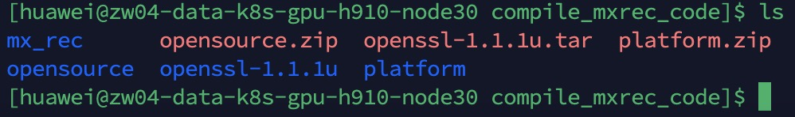
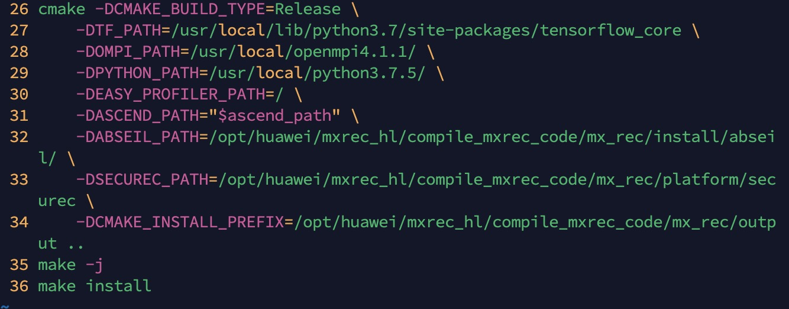

# mxRec

## 介绍
{**以下是 Gitee 平台说明，您可以替换此简介**
Gitee 是 OSCHINA 推出的基于 Git 的代码托管平台（同时支持 SVN）。专为开发者提供稳定、高效、安全的云端软件开发协作平台
无论是个人、团队、或是企业，都能够用 Gitee 实现代码托管、项目管理、协作开发。企业项目请看 [https://gitee.com/enterprises](https://gitee.com/enterprises)}

## 软件架构
软件架构说明

## 编译教程
### 1.1 Opensource准备

下载5个软件包，其中Googletest只在Debug模式下需要。

1.spdlog：https://github.com/gabime/spdlog/archive/refs/tags/v1.9.2.tar.gz

2.pybind11：https://github.com/pybind/pybind11/archive/refs/tags/v2.10.3.tar.gz

3.googletest：https://github.com/google/googletest/archive/refs/tags/release-1.11.0.tar.gz

4.abseil：https://codehub-y.huawei.com/OpenSourceCenter/abseil-cpp/files?ref=20200225
或者 https://github.com/abseil/abseil-cpp

5.hdf5：https://www.hdfgroup.org/packages/hdf5-1108-source/

### 1.2 解压依赖软件包并改名

下载后，执行命令 mkdir -p opensource/opensource/，将5个压缩包放到opensource/opensource路径下并解压，
其中外层的opensource和mxRec代码路径同级。然后将解压后的文件夹名分别改为spdlog、pybind11、
googletest、abseil、hdf5

（可选）改完目录名称之后，如果后续需要跑c++的测试用例，就需要安装googletest，安装googletest
的步骤：

* 进入googletest目录
* 执行cmake -DBUILD_SHARED_LIBS=ON .
* make
* make install
* 执行完上述步骤就安装完googletest了

### 1.3 gcc、cmake

* gcc版本：7.3.1

* cmake版本：3.20.6

### 1.4 securec

* securec：https://github.com/huaweicloud/huaweicloud-sdk-c-obs/tree/master/platform/huaweisecurec

在mxrec代码目录下新建platform/securec文件夹，然后将链接中的三个文件夹（include、lib、src）放入
platform/securec文件夹中。

注：以上1.1-1.4步骤已在30机器上完成，可以直接拿去使用，路径：/opt/huawei/mxrec_hl/compile_mxrec_code，其中，
platform文件夹需要手动将其复制到mxrec代码路径下。

### 2.1 源码编译

#### 2.1.1 将mxrec源码放在与opensource同级目录下，如图所示：

#### 2.1.2 将platform文件夹复制到mxrec目录下

cp -r platform mx_rec

#### 2.1.3 修改build.sh脚本

这里的写的build.sh脚本包含mx_rec/build/build.sh和mx_rec/src/build.sh。其中，mx_rec/build/build.sh经过简化，删除一些
美团这边不需要的代码，已经更改为mx_rec/build/mt_build.sh，客户不需要修改mx_rec/build/build.sh，直接使用这个脚本即可。
另外，mx_rec/src/build.sh这个脚本需要根据美团客户这边的实际情况修改，修改内容是cmake的参数，如图所示：

其中，DTF_PATH是客户容器中tensorflow_core的路径；DOMPI_PATH是容器中openmpi的路径，0030上openmpi的路径是/usr/local/openmpi4.1.1/；
DPYTHON_PATH是python路径，在0030上这个路径是/usr/local/python3.7.5/，因为在这个路径下的lib文件夹中会包含
libpython3.7m.so，否则编译时会报错；DABSEIL_PATH这个参数是mxrec代码路径拼接/install/abseil/得到；DCMAKE_INSTALL_PREFIX
这个参数是mxrec代码路径拼接output目录得到。

#### 2.1.3 执行mx_rec/build/mt_build.sh脚本

执行完mt_build.sh之后会在这个脚本所在的目录下生成mindxsdk-mxrec目录，在这个目录下包含tf1_whl目录，在tf1_whl目录下，
就有编译好的mxrec包。

#### 2.1.4 安装mxrec

执行pip install mx_rec*.whl --force-reinstall 就能安装mxrec了。

#### 安装教程

1. pip install mx_recxxx.whl

#### 使用说明

1.  xxxx
2.  xxxx
3.  xxxx

#### 参与贡献

1.  Fork 本仓库
2.  新建 Feat_xxx 分支
3.  提交代码
4.  新建 Pull Request

#### 特技

1.  使用 Readme\_XXX.md 来支持不同的语言，例如 Readme\_en.md, Readme\_zh.md
2.  Gitee 官方博客 [blog.gitee.com](https://blog.gitee.com)
3.  你可以 [https://gitee.com/explore](https://gitee.com/explore) 这个地址来了解 Gitee 上的优秀开源项目
4.  [GVP](https://gitee.com/gvp) 全称是 Gitee 最有价值开源项目，是综合评定出的优秀开源项目
5.  Gitee 官方提供的使用手册 [https://gitee.com/help](https://gitee.com/help)
6.  Gitee 封面人物是一档用来展示 Gitee 会员风采的栏目 [https://gitee.com/gitee-stars/](https://gitee.com/gitee-stars/)
