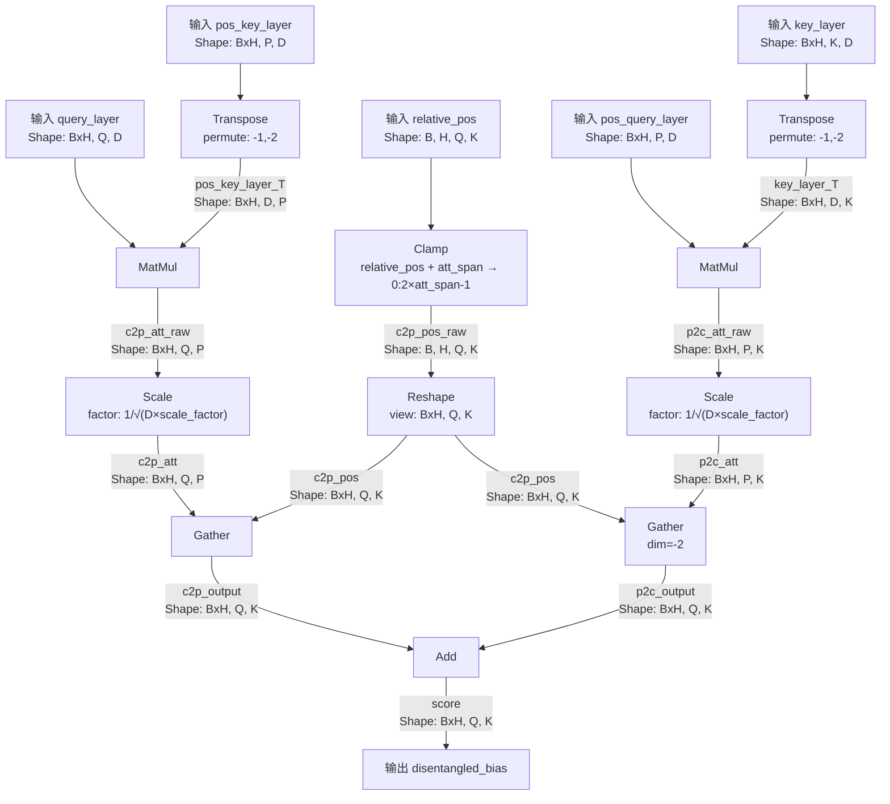

# disetangle_attention算子及样例说明
本算子仅支持NPU调用

## disetangle_attention算子文件结构

```shell
├── disetangle_attention.json    # 算子原型配置
├── op_host    # disetangle_attention算子Host侧实现
├── op_kernel  # disetangle_attention算子Kernel侧实现
├── README.md  # disetangle_attention算子说明文档
└── run.sh     # disetangle_attention算子安装脚本
```

## Ascend C参考设计

更多详情可以参考CANN官方的Ascend
C算子开发手册[Ascend C算子开发](https://www.hiascend.com/document/detail/zh/canncommercial/80RC2/developmentguide/opdevg/Ascendcopdevg/atlas_ascendc_10_0001.html)。

## disetangle_attention算子使用

1. 上传disetangle_attention文件夹到目标环境，并进入当前目录，执行指令对disetangle_attention算子进行编译和部署

默认编译安装Atlas A2训练系列产品AI Core类型：
```shell
bash run.sh
```

指定 AI Core 类型编译：

```shell
bash run.sh ai_core-<soc_version>
```
> AI处理器的型号<soc_version>请通过如下方式获取:
> - 在安装昇腾AI处理器的服务器执行`npu-smi info`命令进行查询，获取`Chip Name`信息。实际配置值为AscendChip Name，例如`Chip Name`取值为`xxxyy`，实际配置值为`Ascendxxxyy`。
>
> 基于同系列的AI处理器型号创建的算子工程，其基础功能（基于该工程进行算子开发、编译和部署）通用。

注：需先在环境中设置CANN相关环境变量，再执行算子编译和安装指令。使用默认路径安装CANN时设置环境变量指令如下：

```shell
source /usr/local/Ascend/ascend-toolkit/set_env.sh
```

## disetangle_attention算子介绍

1. 算子分析

* a) 算子的主要功能是实现deberta模型中的disetangle_attention，解耦注意力的功能
* b) 算子参数说明：

| 名称            | 输入/输出 | 数据类型 | 数据格式     | 备注               |
| --------------- | --------- | -------- | ------------ | ------------------ |
| query_layer     | 输入      | fp16     | (b,n,s,d)    |                    |
| key_layer       | 输入      | fp16     | (b,n,s,d)    |                    |
| value_layer     | 输入      | fp16     | (b,n,s,d)    |                    |
| pos_key_layer   | 输入      | fp16     | (2s, n, d)   |                    |
| pos_query_layer | 输入      | fp16     | (2s, n, d)   |                    |
| relative_pos    | 输入      | int64    | (1,1,s,s)    |                    |
| atten_mask      | 输入      | fp16     | (b, 1, s, s) |                    |
| pos_attr_type   | 属性      | str      | N/A          | 'c2p', 'p2c', 'c2p\|p2c' |
| score_scale     | 属性      | float    | N/A          |                    |
| atten_outputs     | 输出      | fp16     | (b,n,s,d)    |                    |
| atten_probs      | 输出      | fp16     | (b,n,s,s)    |                    |
| atten_weights    | 输出      | fp16     | (b,n,s,s)    |                    |

ps: 

* 如果pos_attr 传入"c2p"只会计算content2postion编码偏置
* 如果pos_attr 传入"p2c"只会计算position2context编码偏置
* 如果pos_attr 传入"c2p|p2c" 则都会计算并将上述两个偏置累加后输出

c) 算子约束说明：

* 支持的型号：Atlas A2系列产品;
* 支持的CANN版本：8.2.RC1.alpha001及之后版本；
* b: 取值范围[0, 100]
* n: 取值范围[0, 64]
* s: 取值为256
* d: 取值范围[1, 512]
* 数据类型: fp16

## 算子逻辑
