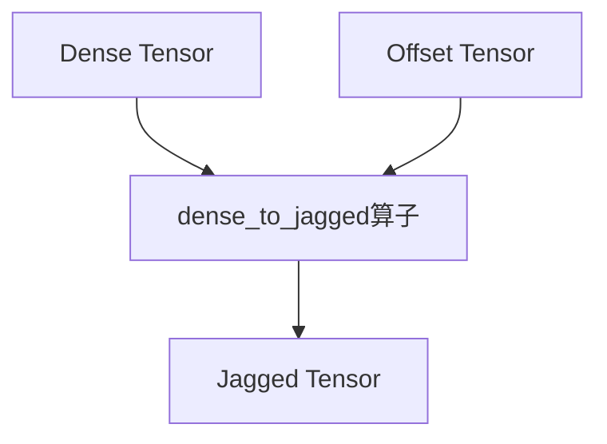
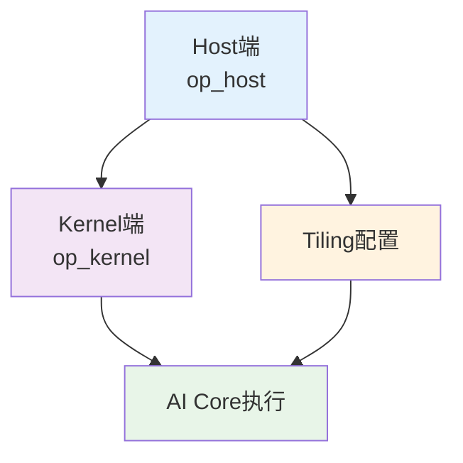
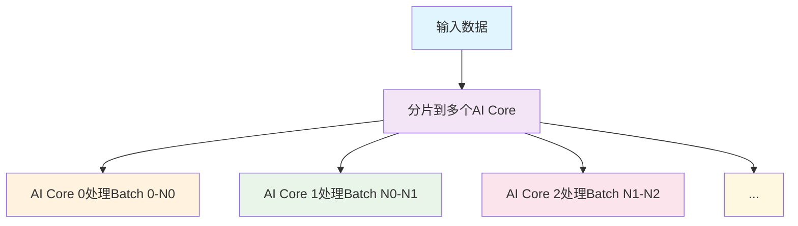
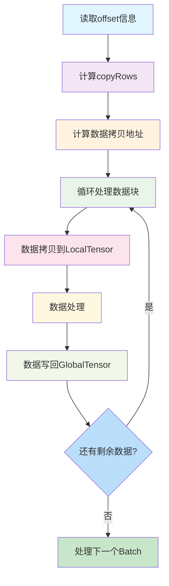

# dense_to_jagged算子详细设计方案

## 1. 算子概述

dense_to_jagged算子是FBGEMM库中用于将padded dense张量转换为jagged张量的关键算子。该算子在推荐系统中广泛应用于处理变长序列数据，将填充后的固定维度张量转换为紧凑的不规则张量格式。

### 1.1 基本概念
- **Dense张量**：经过填充的固定维度张量，形状为[B, MaxT, D]，其中B是批次大小，MaxT是最大序列长度，D是特征维度
- **Offset张量**：记录每个序列实际长度的一维张量，长度为B+1，从0开始递增
- **Jagged张量**：紧凑存储的不规则张量，形状为[Total_L, D]，其中Total_L是所有序列实际长度之和

### 1.2 转换逻辑示意图



### 1.3 算子核心算法

根据README中的伪代码，算子的核心逻辑如下：

```python
def dense_to_jagged(dense, offset, jagged_dim0):
    jagged_dense = torch.zeros(jagged_dim0, dense.shape[2], dtype=dense.dtype, device=dense.device)
    
    for i in range(offset.shape[0] - 1):
        copyLen = offset[i + 1] - offset[i]
        jagged_dense[offset[i]:offset[i + 1], :] = dense[i, 0:copyLen, :]
    
    return jagged_dense
```

## 2. Ascend C算子实现架构

### 2.1 整体架构图



### 2.2 Host端实现（op_host）

Host端主要负责：
1. **形状推导**：根据输入张量形状推导输出张量形状
2. **数据类型推导**：确定输出张量的数据类型
3. **Tiling配置**：根据硬件资源和数据规模生成分片配置

核心代码分析：
```cpp
// 输入约束检查
OPS_CHECK(denseShape.GetDim(DIM0) != offsetShape.GetDim(DIM0) - 1,
    OPS_LOG_E("[ERROR]", "dense shape[0] != offset shape[0] - 1"), return ge::GRAPH_FAILED);

// 分片配置计算
int singleCoreBatch = (offsetShape.GetDim(DIM0) - 1) / coreNum;
int left = (offsetShape.GetDim(DIM0) - 1) % coreNum;
int singleLoopSize = (ubSize - RESERVER_UB_SIZE) / 2 / ALIGN_512 * ALIGN_512;
```

## 3. Kernel端实现详解（op_kernel）

Kernel端使用Ascend C编程模型实现具体的计算逻辑，这是整个算子的核心部分。

### 3.1 数据结构定义

```cpp
struct DenseToJaggedArgs {
    GM_ADDR dense;          // 输入dense张量的全局内存地址
    GM_ADDR offset;         // 输入offset张量的全局内存地址
    GM_ADDR jagged_dense;   // 输出jagged_dense张量的全局内存地址

    int32_t denseDim1;      // dense张量的第1维大小(MaxT)
    int32_t denseDim2;      // dense张量的第2维大小(D)
    int32_t left;           // 分片处理中余下的batch数
    int32_t singleCoreBatch;// 每个AI Core处理的batch数
    int32_t singleLoopSize; // 单次循环处理的数据大小
    int64_t denseTotal;     // dense张量总元素数
    int64_t jaggedTotal;    // jagged_dense张量总元素数
};
```

### 3.2 核心类实现

```cpp
template<typename dType, typename tType>
class DenseToJagged {
public:
    __aicore__ inline DenseToJagged() {};

    __aicore__ inline void init(DenseToJaggedArgs *args, TPipe *pipe)
    {
        this->args = args;
        this->pipe = pipe;

        thisId = GetBlockIdx();
        if (thisId < args->left) {
            args->singleCoreBatch += 1;
            offsetStartPos = thisId * args->singleCoreBatch;
        } else {
            offsetStartPos = (args->singleCoreBatch + 1) * args->left + 
                             (thisId - args->left) * args->singleCoreBatch;
        }

        align = sizeof(dType);
        denseGb.SetGlobalBuffer(reinterpret_cast<__gm__ uint8_t*>(args->dense), 
                                args->denseTotal * align);
        jaggedDenseGb.SetGlobalBuffer(reinterpret_cast<__gm__ uint8_t*>(args->jagged_dense), 
                                      args->jaggedTotal * align);

        pipe->InitBuffer(inQueue, 1, args->singleLoopSize);
        pipe->InitBuffer(outQueue, 1, args->singleLoopSize);
    }

    __aicore__ inline void Compute()
    {
        ComputeEachBatch();
    }
};
```

### 3.3 核心计算逻辑详解

Kernel端的核心计算过程可以分为以下几个步骤：

#### 3.3.1 多核并行处理策略


#### 3.3.2 单个Batch处理流程

对于每个AI Core处理的每个Batch，核心计算流程如下：



#### 3.3.3 详细计算过程

1. **获取offset信息**：
   ```cpp
   jaggedPos = *(oPtr + offsetStartPos + i);
   jaggedPosNext = *(oPtr + offsetStartPos + i + 1);
   int copyRows = jaggedPosNext - jaggedPos;
   ```

2. **计算数据拷贝地址**：
   ```cpp
   GlobalTensor<uint8_t> jaggedDenseCopyGb = jaggedDenseGb[jaggedPos * args->denseDim2 * align];
   GlobalTensor<uint8_t> denseCopyGb = denseGb[(offsetStartPos + i) * args->denseDim2 * args->denseDim1 * align];
   ```

3. **循环处理数据块**：
   - 计算本次需要处理的数据长度
   - 分配LocalTensor缓冲区
   - 进行数据对齐处理
   - 执行数据拷贝操作
   - 处理未对齐的数据尾部

4. **数据拷贝与处理**：
   ```cpp
   // 拷贝超对齐大小数据以避免处理未对齐尾部
   DataCopy(localIn, denseCopyGb, overAlignLen);
   
   // 数据在输入输出队列间传递
   DataCopy(localOut, localInCopy, overAlignLen);
   
   // 拷贝对齐部分数据
   DataCopy(jaggedDenseCopyGb, localOutCopy, alignLen);
   
   // 处理未对齐尾部数据
   if (unAlignLen != 0) {
       const DataCopyExtParams dataCopyExtParams{1, unAlignLen, 0, 0, 0};
       DataCopyPad(jaggedDenseCopyGb[alignLen], localOutCopy[alignLen], dataCopyExtParams);
   }
   ```

### 3.4 内存管理与优化

Kernel端使用了以下内存优化策略：

1. **LocalTensor缓冲区**：
   - 使用TQue队列管理LocalTensor
   - inQueue用于输入数据缓冲
   - outQueue用于输出数据缓冲

2. **数据对齐处理**：
   - 使用ALIGN_32进行32字节对齐
   - 分别处理对齐部分和未对齐部分数据

3. **流水线处理**：
   - 使用Ascend C的TPipe进行流水线操作
   - 提高数据处理效率

### 3.5 类型支持

Kernel支持多种数据类型组合：

```cpp
// 修改前的实现方式（使用多个if-else分支）
if (tiling_data.denseType == floatType && tiling_data.offsetType == int32Type) {
    DenseToJagged_Kernel::DenseToJagged<float, int32_t> kernel;
    kernel.init(&args, &pipe);
    kernel.Compute();
} else if (tiling_data.denseType == floatType && tiling_data.offsetType == int64Type) {
    DenseToJagged_Kernel::DenseToJagged<float, int64_t> kernel;
    kernel.init(&args, &pipe);
    kernel.Compute();
} else if (tiling_data.denseType == int64Type && tiling_data.offsetType == int64Type) {
    DenseToJagged_Kernel::DenseToJagged<int64_t, int64_t> kernel;
    kernel.init(&args, &pipe);
    kernel.Compute();
} else if (tiling_data.denseType == int64Type && tiling_data.offsetType == int32Type) {
    DenseToJagged_Kernel::DenseToJagged<int64_t, int32_t> kernel;
    kernel.init(&args, &pipe);
    kernel.Compute();
}

// 修改后的实现方式（使用宏定义方式）
extern "C" __global__ __aicore__ void dense_to_jagged(GM_ADDR dense, GM_ADDR offset, GM_ADDR jagged_dense,
    GM_ADDR workspace, GM_ADDR tiling) {
    GET_TILING_DATA(tiling_data, tiling);

    DenseToJagged_Kernel::DenseToJaggedArgs args {
        dense, offset, jagged_dense, tiling_data.denseDim1, tiling_data.denseDim2, tiling_data.left,
        tiling_data.singleCoreBatch, tiling_data.singleLoopSize, tiling_data.denseTotal, tiling_data.jaggedTotal
    };

    TPipe pipe;
    DenseToJagged_Kernel::DenseToJagged<DTYPE_DENSE, DTYPE_OFFSET> kernel;
    kernel.init(&args, &pipe);
    kernel.Compute();
}
```

## 4. PTA适配层实现

PTA（PyTorch Adapter）层负责将PyTorch的调用转换为Ascend算子调用：

### 4.1 接口定义
```cpp
TORCH_LIBRARY_FRAGMENT(mxrec, m)
{
    m.def("dense_to_jagged_forward(Tensor dense, "
          "                        Tensor[] offsets, "
          "                        SymInt? total_L=None) -> Tensor");

    m.def("dense_to_jagged(Tensor dense, "
          "                Tensor[] offsets, "
          "                SymInt? total_L=None) -> (Tensor, Tensor[])");
}
```

### 4.2 核心实现逻辑
```cpp
at::Tensor dense_to_jagged_forward_npu(const at::Tensor& dense,
                                       const tensor_list& offsets,
                                       const c10::optional<int64_t> total_L)
{
    // 参数检查
    TORCH_CHECK(dense.dim() == 3, "dense must be 3-dimensional");
    TORCH_CHECK(offsets.size() == 1, "Only single-dimension jagged tensors supported");
    
    // 计算输出大小
    int64_t expected_total_L = offsets.back()[-1].item<int64_t>();
    int64_t totalLength = total_L.value_or(expected_total_L);
    
    // 支持BF16和FP16类型，需要先转换为FP32进行处理，然后转回原类型
    if (dense.dtype() == at::kBFloat16 || dense.dtype() == at::kHalf) {
        auto dense_float = dense_contin.to(at::kFloat);
        EXEC_NPU_CMD(aclnnDenseToJagged, dense_float, offsets[0], totalLength, output);
        return output.to(dense.dtype());
    } else {
        EXEC_NPU_CMD(aclnnDenseToJagged, dense_contin, offsets[0], totalLength, output);
        return output;
    }
};
```

## 5. 测试用例分析

测试用例位于`mxrec_add_ons/rec_for_torch/torch_plugin/torch_demo/dense_to_jagged/test_dense_to_jagged.py`，主要覆盖以下方面：

### 5.1 功能测试
- 不同数据类型组合测试（float32/int64/bfloat16/float16/int32作为dense，int32/int64作为offset）
- 不同维度参数测试
- output_size参数的有无测试

### 5.2 精度测试
- 与CPU参考实现结果对比，确保精度误差在1e-4以内

### 5.3 自动求导测试
- 前向传播结果验证
- 反向传播梯度验证

测试用例核心代码：
```python
@pytest.mark.parametrize("dims", DIM_LIST)
@pytest.mark.parametrize("types", TYPE_LIST)
@pytest.mark.parametrize("use_output_size", [True, False])
def test_dense_to_jagged(dims, types, use_output_size):
    dense_dim0, dense_dim1, dense_dim2 = dims
    # 1. 生成随机输入数据
    denses = np.random.randn(dense_dim0, dense_dim1, dense_dim2).astype(np.float32)
    offsets = np.random.randint(0, dense_dim1, dense_dim0) # 生成随机偏移量

    # 2. 分别获取CPU和NPU结果
    golden_result = get_result(torch.device("cpu"), denses, offsets, types, use_output_size)
    npu_result = get_result(torch.device(DEVICE), denses, offsets, types, use_output_size)

    # 3. 结果比对（允许1e-4的误差）
    result_forward = torch.abs(golden_result[0] - npu_result[0]) < 1e-4
    logging.info(result_forward.all().item())  # 输出是否全部通过验证
```

## 6. 与CUDA实现对比

| 特性 | Ascend实现 | CUDA实现 | 差异分析 |
|------|------------|----------|----------|
| 编程模型 | Ascend C | CUDA C | 语法和API不同，但核心算法一致 |
| 内存管理 | GM/L1/L0三级缓存 | Global/Shared/Register | 架构差异导致内存层级不同 |
| 并行策略 | 多AI Core并行 | 多线程块并行 | 并行粒度和调度机制不同 |
| 数据对齐 | 32字节对齐 | 通常16字节对齐 | 对齐要求不同 |
| 精度 | fp32/fp16/bf16/int64/int32 | fp32/fp16/bf16/int64/int32 | 精度支持基本一致 |

## 7. 性能优化建议

### 7.1 查表法重构建议

当前[dense_to_jagged](file:///c%3A/zengxiong/RecSDK/mxrec_add_ons/rec_for_torch/operators/dense_to_jagged/op_kernel/dense_to_jagged.cpp#L180-L180)函数中使用了多个if-else分支来处理不同的数据类型组合，可以考虑使用查表法进行重构以提高性能：

```cpp
// 定义函数指针类型
typedef void (*KernelFunc)(DenseToJagged_Kernel::DenseToJaggedArgs*, TPipe*);

// 定义内核函数模板实例化
template<typename DT, typename OT>
void LaunchKernel(DenseToJagged_Kernel::DenseToJaggedArgs* args, TPipe* pipe) {
    DenseToJagged_Kernel::DenseToJagged<DT, OT> kernel;
    kernel.init(args, pipe);
    kernel.Compute();
}

// 定义查表结构
struct KernelEntry {
    int denseType;
    int offsetType;
    KernelFunc func;
};

// 构建内核函数查找表
static const KernelEntry kernelTable[] = {
    {DenseToJagged_Kernel::TYPE_FLOAT, DenseToJagged_Kernel::TYPE_INT32, LaunchKernel<float, int32_t>},
    {DenseToJagged_Kernel::TYPE_FLOAT, DenseToJagged_Kernel::TYPE_INT64, LaunchKernel<float, int64_t>},
    {DenseToJagged_Kernel::TYPE_INT64, DenseToJagged_Kernel::TYPE_INT64, LaunchKernel<int64_t, int64_t>},
    {DenseToJagged_Kernel::TYPE_INT64, DenseToJagged_Kernel::TYPE_INT32, LaunchKernel<int64_t, int32_t>},
    {DenseToJagged_Kernel::TYPE_BF16, DenseToJagged_Kernel::TYPE_INT32, LaunchKernel<bfloat16_t, int32_t>},
    {DenseToJagged_Kernel::TYPE_BF16, DenseToJagged_Kernel::TYPE_INT64, LaunchKernel<bfloat16_t, int64_t>},
    {DenseToJagged_Kernel::TYPE_FP16, DenseToJagged_Kernel::TYPE_INT32, LaunchKernel<float16_t, int32_t>},
    {DenseToJagged_Kernel::TYPE_FP16, DenseToJagged_Kernel::TYPE_INT64, LaunchKernel<float16_t, int64_t>},
    {DenseToJagged_Kernel::TYPE_INT32, DenseToJagged_Kernel::TYPE_INT32, LaunchKernel<int32_t, int32_t>},
    {DenseToJagged_Kernel::TYPE_INT32, DenseToJagged_Kernel::TYPE_INT64, LaunchKernel<int32_t, int64_t>}
};

// 使用查表法调用内核函数
extern "C" __global__ __aicore__ void dense_to_jagged(GM_ADDR dense, GM_ADDR offset, GM_ADDR jagged_dense,
    GM_ADDR workspace, GM_ADDR tiling) {
    GET_TILING_DATA(tiling_data, tiling);

    DenseToJagged_Kernel::DenseToJaggedArgs args {
        dense, offset, jagged_dense, tiling_data.denseDim1, tiling_data.denseDim2, tiling_data.left,
        tiling_data.singleCoreBatch, tiling_data.singleLoopSize, tiling_data.denseTotal, tiling_data.jaggedTotal
    };

    TPipe pipe;
    
    // 查找并调用对应的内核函数
    for (const auto& entry : kernelTable) {
        if (entry.denseType == tiling_data.denseType && entry.offsetType == tiling_data.offsetType) {
            entry.func(&args, &pipe);
            return;
        }
    }
    
    // 如果没有找到匹配的类型组合，可以抛出错误或使用默认处理
}
```

通过这种方式，可以将原来的多个if-else分支简化为一个查表过程，不仅提高了代码的可读性，也可能在某些编译器优化下获得更好的性能。不过需要注意的是，这种优化的实际效果还需要通过性能测试来验证。

## 8. 本次修改点总结

### 8.1 主要修改内容

1. **JSON配置文件修改**：
   - 增加了对int32、bf16、fp16数据类型的支持
   - 简化了format字段定义方式，使用format_list替代原来的重复定义

2. **Host端代码修改**：
   - 使用DataTypeList替代DataType方式定义支持的数据类型
   - 增加了对int32、bf16和fp16类型的支持
   - 输出张量使用Follow方式继承输入张量的数据类型，简化了配置

3. **Kernel端代码修改**：
   - 采用宏定义方式(DTYPE_DENSE, DTYPE_OFFSET)替代复杂的if-else分支判断
   - 移除了手动类型判断代码，使用AscendC的模板机制自动推导类型
   - 代码结构更加简洁，提高了可维护性

4. **PTA适配层修改**：
   - 修改了函数返回值类型，从单一Tensor改为tuple形式，与fbgemm接口保持一致

5. **测试用例修改**：
   - 增加了对新增数据类型的支持测试
   - 增加了边界情况和特殊场景测试
   - 完善了测试框架，提高了代码复用性

### 8.2 优化点

1. **代码结构优化**：
   - Kernel端使用宏定义方式替代大量if-else分支，代码更简洁
   - Host端使用DataTypeList方式定义类型，更符合规范

2. **测试完善**：
   - 增加了全面的数据类型测试
   - 增加了边界和特殊场景测试
   - 重构了测试框架，提高了代码复用性和可维护性

3. **文档更新**：
   - 更新了README文档中的支持数据类型说明
   - 提供了完整的设计文档