 # EmbCache训练流水线和准入淘汰机制详细流程图

## 1. 整体架构图

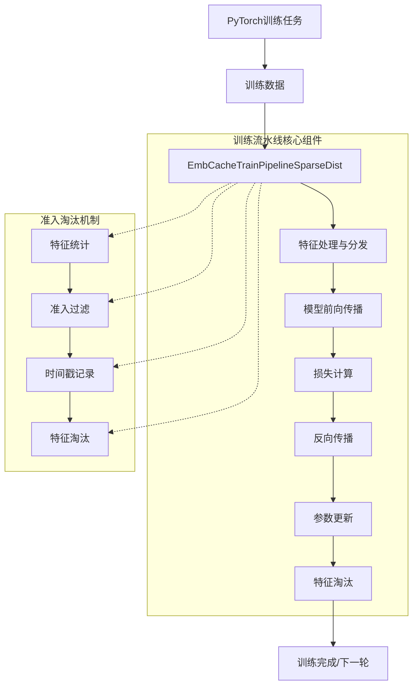

## 2. 训练流水线详细流程图

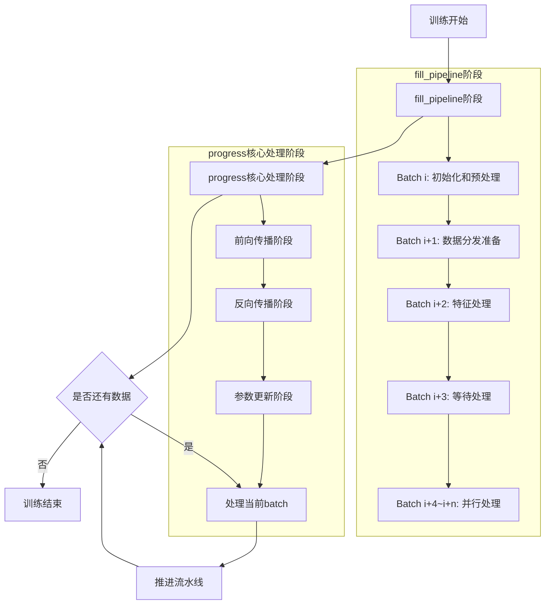

## 3. fill_pipeline阶段详细流程图

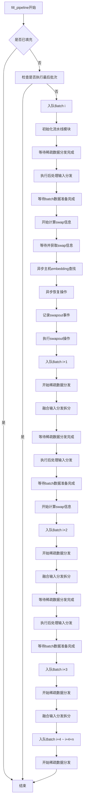

## 4. progress核心处理阶段详细流程图

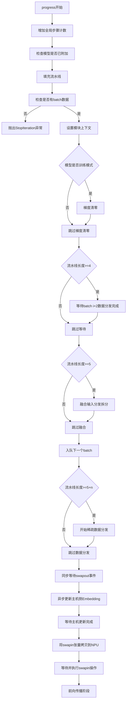

## 5. 前向传播阶段详细流程图

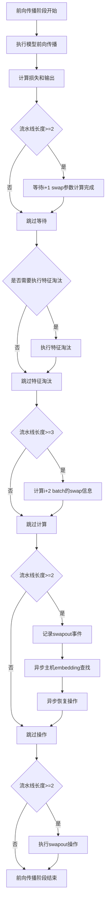

## 6. 反向传播阶段详细流程图

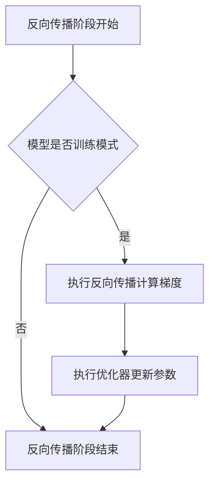

## 7. 参数更新阶段详细流程图

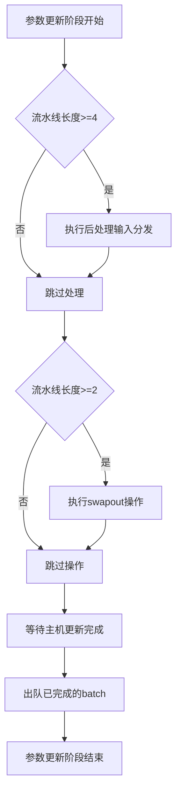

## 8. 准入淘汰机制在流水线中的位置图

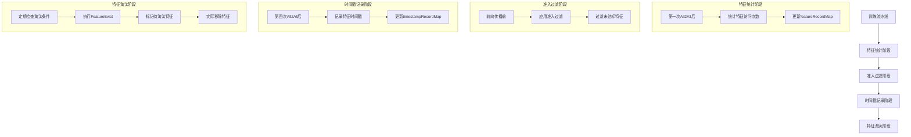

## 9. 数据准确性保障机制图

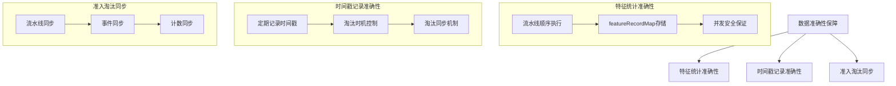

## 10. 四次All2All操作与准入淘汰交互图

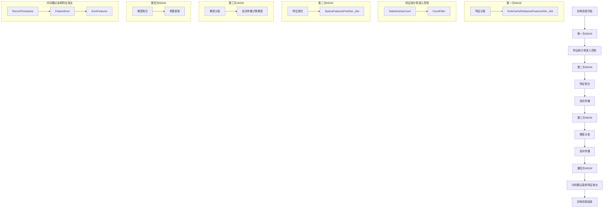

## 11. 准入淘汰机制详细流程图

### 11.1 特征统计流程图

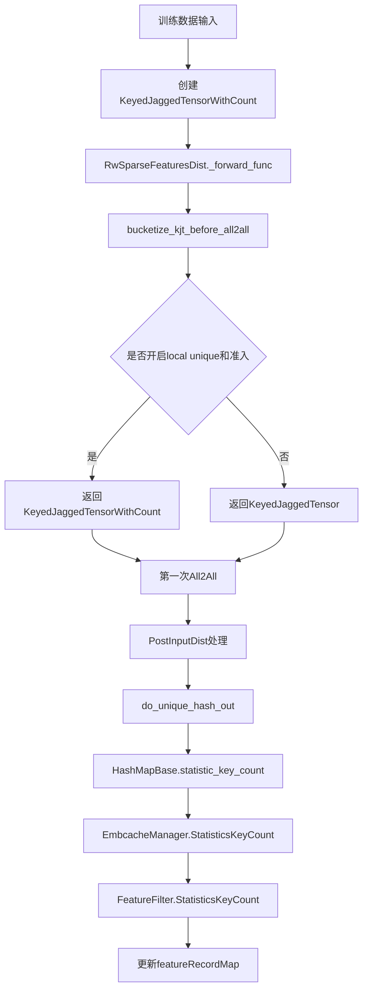

### 11.2 准入过滤流程图

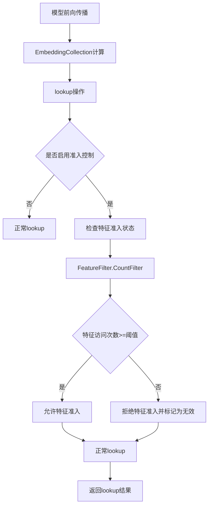

### 11.3 时间戳记录流程图

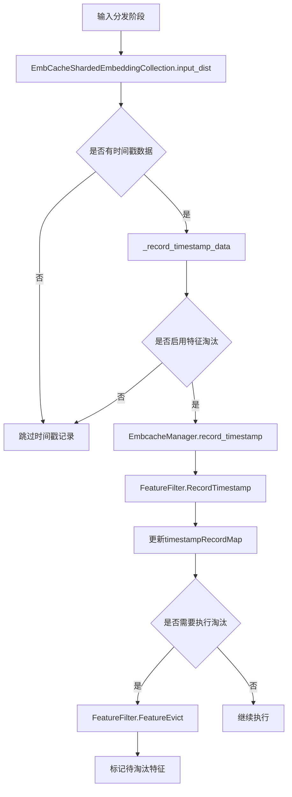

### 11.4 特征淘汰流程图

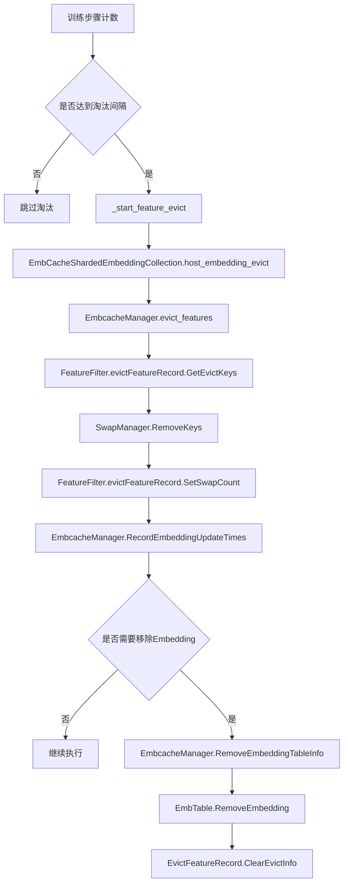

## 12. 准入淘汰机制与训练流水线集成图

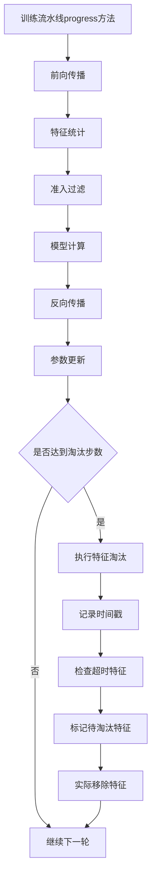