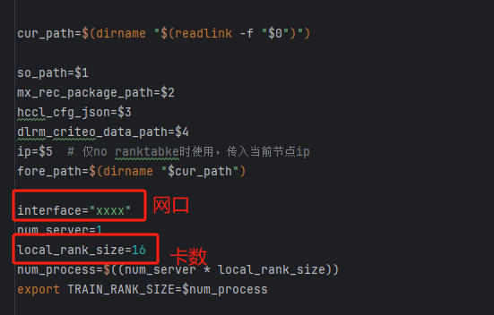
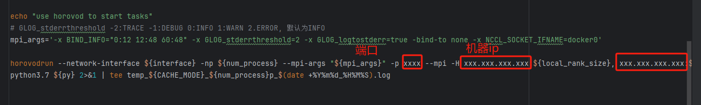

# DCNv2模型运行说明

## 代码结构
```shell
.
├── config.py  # 模型配置文件
├── delay_loss_scale.py  # loss缩放函数
├── main_mxrec.py     # 主函数
├── model.py          # DCNv2模型
├── op_impl_mode.ini  # 算子执行模式配置
├── optimizer.py      # 优化器
├── README.md         # DCNv2模型运行说明
└── run_1_16_8192.sh            # 运行DCNv2模型的脚本

```

## 1.准备数据
### 1.1 onehot to multihot 数据转换
参考 https://github.com/NVIDIA-Merlin/HugeCTR/blob/main/samples/dlrm/README.md 1.1-1.5完成数据集下载，multihot numpy文件的转
换，会得到day_*_labels.npy, day_*_dense.npy and day_0_sparse.npy 假设存放于/data/criteo_all/data_npy文件夹下，还会得到转换为
multihot的day_*_sparse_multi_hot.npz文件， 假设存放于/data/criteo_all/data_npz/ 文件夹下。
注意：此时所占用空间大概需要7T总空间。
### 1.2 数据格式转换 - tfrecord 格式文件

运行脚本 
```shell
python convert_multi_hot_2_tfrecord.py --npz_path /data/criteo_all/data_npz --npy_path /data/criteo_all/data_npy --output_path xxx
```
注意：为了节省空间，文件最后采用删除npz文件方法，若想保留所有中间结果，请删除最后一行代码

## 2.准备运行环境
运行环境可以参考[mxRec用户指南](https://www.hiascend.com/document/detail/zh/mind-sdk/60rc2/mxRec/mxrecug/mxrecug_0010.html)
“安装部署”章节进行准备。

## 3.安装mxRec
mxRec软件包可以通过[mxRec用户指南](https://www.hiascend.com/document/detail/zh/mind-sdk/60rc2/mxRec/mxrecug/mxrecug_0010.html)
“安装部署”>“环境准备”>“获取软件包”章节提供的链接进行下载，选择自己需要的架构（x86或者arm）的mxRec包。下载完成之后，将mxRec包解压，进入解压后的目录（mindxsdk-mxrec）
如下：
```shell
├── tf1_whl
│   └── mx_rec-{version}-py3-none-linux_x86_64.whl  # version为版本号
├── tf2_whl
│   └── mx_rec-{version}-py3-none-linux_x86_64.whl  # version为版本号
└── version.info
```
其中，tf1_whl和tf2_whl目录下分别是适配tf1和tf2的mxRec软件包，按照自己需要选择其中一个进行安装即可（用pip/pip3 install 软件包这种方式进行安装）。
确认安装mxRec的目录，比如mxRec安装在 /usr/local/python3.7.5/lib/python3.7/site-packages/mx_rec这个目录下。

## 4.运行DCNv2模型
执行完以上步骤之后，接下来就可以运行DCNv2模型，其中run.sh就是运行的脚本。 其中需要传入5个参数，分别对应：so_path、mx_rec_package_path、hccl_cfg_json、
dlrm_criteo_data_path和ip。运行命令如：
```shell
bash run_1_16_8192.sh {so_path} {mx_rec_package_path} {hccl_cfg_json} {dlrm_criteo_data_path} {ip}
```
* so_path：so_path是mxRec中动态库的目录，一般在mxRec的安装目录下的libasc目录，比如：/usr/local/python3.7.5/lib/python3.7/site-packages/mx_rec/libasc。
* mx_rec_package_path：mx_rec_package_path是mxRec的安装目录，比如：/usr/local/python3.7.5/lib/python3.7/site-packages/mx_rec。
* hccl_cfg_json：hccl_cfg_json是hccl通信配置文件，如果配置了ip参数，这个参数就不用了，直接给一个""空字符串即可,pod A3不建议使用。
* dlrm_criteo_data_path：dlrm_criteo_data_path是数据集所在的目录，比如/data/criteo_tb/。
* ip：ip是运行模型的机器所在的ip，建议配置。
* 注意：配置ip运行需改动main_mxrec.py中os.environ['CM_WORKER_IP'] = "x.x.x.x"，将"x.x.x.x"改为对应宿主机IP地址。

## 5.优化器使用事项注意：
在使用adgrad优化器时，需做出如下调整：
* 1.将config.py文件中
```
custom_op.parameter_map["precision_mode"].s = tf.compat.as_bytes("allow_mix_precision")
```
修改为  
```
custom_op.parameter_map["precision_mode"].s = tf.compat.as_bytes("must_keep_origin_dtype")
```
* 2.添加关闭融合算子配置文件。新增fusion_switch.cfg 文件并插入如下配置
```josn
{
    "Switch":{
        "GraphFusion":{
            "BatchMatMul2MulFusionPass":"off"
        }
    }
}
```
* 3.修改mxrec源码，删除adagrad.py中对`initial_accumulator_value`参数的校验，并将
```python
return training_ops.sparse_apply_adagrad(
    var,
    acc,
    math_ops.cast(self._learning_rate_tensor, var.dtype.base_dtype),
    grad.values,
    grad.indices,
    use_locking=self._use_locking,
)
```
修改为
```python
return training_ops.sparse_apply_adagrad_v2(
    var, 
    acc, 
    math_ops.cast(self._learning_rate_tensor, var.dtype.base_dtype), 1e-8, 
    grad.values,
    grad.indices,
    use_locking=self._use_locking)
```
默认路径为：/usr/local/pythonx.x.x/lib/pythonx.x/site-packages/mx_rec/optimizers/adagrad.py
* 4.修改tensorflow 1.15.0源码, install后脚本默认位置为/usr/local/pythonx.x.x/lib/pythonx.x/site-packages/tensorflow_core/python/training/adagrad.py。
修改62行校验参数，<= 改为<, 修改96行-103行为：
```python
  def _apply_dense(self, grad, var):
    acc = self.get_slot(var, "accumulator")
    return training_ops.apply_adagrad_v2(
        var,
        acc,
        math_ops.cast(self._learning_rate_tensor, var.dtype.base_dtype), 1e-8,
        grad,
        use_locking=self._use_locking)
```
* 5.使用adgrad优化器，需要使用固定学习率。sparse和dense均使用0.004
* 注意：3-4条修改为对齐adagrad实现，若无法修改修改源码，可将optimizer.py中initial_addumulator_value初始化为一个很小的值如1e-20，效果类似。
如果需要再增大global batchsize时请在run脚本添加adacons参数。
export use_adacons=True

## 6.多机运行DCNv2
* 1. 宿主机容器外配置多机之间配置免密登录 ssh-copy-id -i ~/.ssh/id_rsa.pub xxx@xxx.xxx.xx.xx。 
* 2. 容器内配置端口监听 /usr/sbin/sshd -o port=xxxx
* 3. 修改run_2_16_8192.sh 脚本中，网口，卡数，端口，机器ip


注意，多机 cann，hdk， mxrec，均需要使用相同版本。