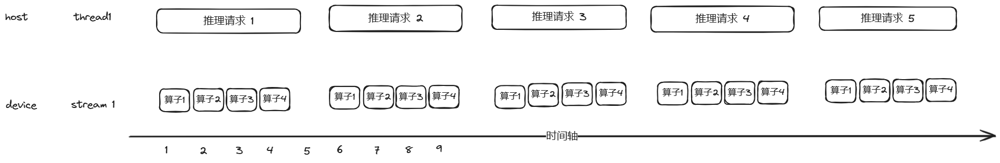
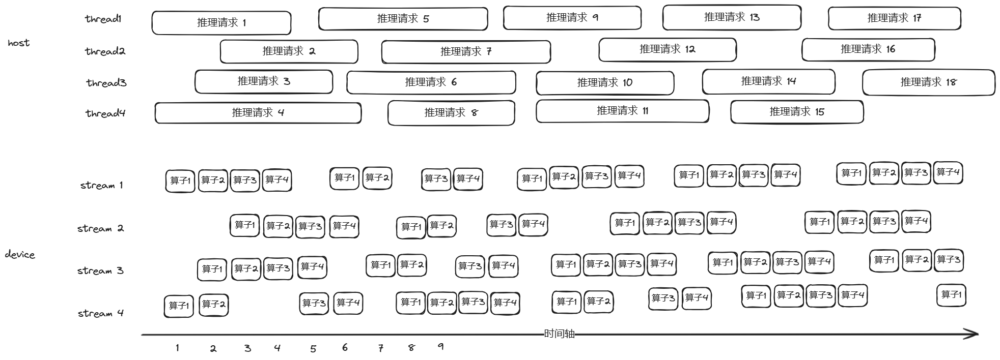

# 推理环境部署
一、安装依赖包：</p>
安装开发套件包Ascend-cann-toolkit_{version}_linux-{arch}.run</p>
安装框架插件包Ascend-cann-tfplugin_{version}_linux-{arch}.run</p>
安装其他依赖包：</p>
|依赖包   |  版本限制|
|:---|:---:|
|gcc,g++|8.4及以上版本|
|zip,unzip,libtool,automake|无特定版本要求|
|python|3.7.5|
|TensorFlow| 1.15.0|
|tensorflow-serving-api|1.15.0|
|future|无特定版本要求|
|bazel|0.24.1|
|camake|3.14.0|
|swig|若操作系统为"aarch64"，软件安装版本需大于或等于3.0.12。若操作系统架构为"X86_64"，软件安装版本需大于或等于4.0.1|
|java|jdk-11|
|||

二、编译serving
1. 下载TF-serving源码：https://github.com/tensorflow/serving/archive/1.15.0.zip
2. 解压后进入源码目录
3. 添加TF-serving第三方依赖

a.执行如下命令，在“serving-1.15.0/third_party”目录下创建“tf_adapter”文件夹并进入。
>cd third_party/<br>
mkdir tf_adapter<br>
cd tf_adapter<br>

b.执行如下命令，在“tf_adapter”文件夹下拷贝存放“libpython3.7m.so.1.0”文件，并创建软链接。
> cp /usr/local/python3.7.5/lib/libpython3.7m.so.1.0 .<br>
ln -s libpython3.7m.so.1.0 libpython3.7m.so<br>

c.执行如下命令，在“tf_adapter”文件夹下拷贝存放“_tf_adapter.so”文件，并将“_tf_adapter.so”文件拷贝一份为“lib_tf_adapter.so”。
>cp /home/HwHiAiUser/Ascend/tfplugin/latest/python/site-packages/npu_bridge/_tf_adapter.so .<br>
cp _tf_adapter.so lib_tf_adapter.so<br>

4. 编译空的libtensorflow_framework.so、_pywrap_tensorflow_internal.so文件.

a. 在“tf_adapter”文件夹下，执行如下命令。
>vim CMakeLists.txt<br>

b. 写入如下内容保存。
```text
file(TOUCH ${CMAKE_CURRENT_BINARY_DIR}/stub.c)
add_library(_pywrap_tensorflow_internal SHARED ${CMAKE_CURRENT_BINARY_DIR}/stub.c)
add_library(tensorflow_framework SHARED ${CMAKE_CURRENT_BINARY_DIR}/stub.c)
```

c.执行:wq!命令保存文件并退出。
d.执行如下命令，编译出空的.so文件。
> mkdir temp<br>
cd temp<br>
cmake ..<br>
make<br>
mv lib_pywrap_tensorflow_internal.so ../_pywrap_tensorflow_internal.so<br>
mv libtensorflow_framework.so ../libtensorflow_framework.so<br>
cd ..<br>
ln -s libtensorflow_framework.so libtensorflow_framework.so.1<br>

e.配置环境命令。
```text
export LD_LIBRARY_PATH=$LD_LIBRARY_PATH:$(pwd)
```

5. 在“tf_adapter”文件夹下创建BUILD文件。 写入如下内容。
```text
licenses(["notice"])  # BSD/MIT.

cc_import(
    name = "tf_adapter",
    shared_library = "lib_tf_adapter.so",
    visibility = ["//visibility:public"]
)

cc_import(
    name = "tf_python",
    shared_library = "libpython3.7m.so",
    visibility = ["//visibility:public"]
)
```

6. 修改“serving-1.15.0/tensorflow_serving/model_servers/”路径下的BUILD文件，在“cc_binary”中添加如下加粗内容。

>cc_binary(<br>
name = "tensorflow_model_server",<br>
&nbsp;&nbsp;&nbsp;&nbsp; stamp = 1,<br>
&nbsp;&nbsp;&nbsp;&nbsp; visibility = [<br>
&nbsp;&nbsp;&nbsp;&nbsp;&nbsp;&nbsp;&nbsp;&nbsp; ":testing",<br>
&nbsp;&nbsp;&nbsp;&nbsp;&nbsp;&nbsp;&nbsp;&nbsp; "//tensorflow_serving:internal",<br>
&nbsp;&nbsp;&nbsp;&nbsp; ],<br>
&nbsp;&nbsp;&nbsp;&nbsp; deps = [<br>
&nbsp;&nbsp;&nbsp;&nbsp;&nbsp;&nbsp;&nbsp;&nbsp; ":tensorflow_model_server_main_lib",<br>
&nbsp;&nbsp;&nbsp;&nbsp;&nbsp;&nbsp;&nbsp;&nbsp; __"//third_party/tf_adapter:tf_adapter",__<br>
&nbsp;&nbsp;&nbsp;&nbsp;&nbsp;&nbsp;&nbsp;&nbsp; __"//third_party/tf_adapter:tf_python",__<br>
&nbsp;&nbsp;&nbsp;&nbsp;&nbsp;&nbsp;&nbsp;&nbsp; __"@org_tensorflow//tensorflow/compiler/jit:xla_cpu_jit",__<br>
&nbsp;&nbsp;&nbsp;&nbsp; ],<br>
)<br>

7. TF Serving,在TF Serving安装目录“serving-1.15.0”下执行如下命令，编译TF Serving。

> bazel --output_user_root=/opt/tf_serving build -c opt --distdir=../depends --cxxopt="-D_GLIBCXX_USE_CXX11_ABI=0" tensorflow_serving/model_servers:tensorflow_model_server<br>

如果编译过程中遇到依赖包下载失败问题，可手动下载，TF serving编译依赖包(https://www.hiascend.com/document/detail/zh/canncommercial/80RC1/developmentguide/moddevg/onlineinfer1/atlastfserv_26_0011.html)

8. 建立软连接。
> ln -s /opt/tf_serving/{tf_serving_ID}/execroot/tf_serving/bazel-out/xxx-opt/bin/tensorflow_serving/model_servers/tensorflow_model_server /usr/local/bin/tensorflow_model_server<br>

+ {tf_serving_ID}为一串如“063944eceea3e72745362a0b6eb12a3c”的无规则字符。请根据实际进行填写。
+ xxx-opt为工具自动生成文件夹，具体显示请以实际为准。

# 脚本工具介绍
server.sh/client.sh
启动服务脚本/客户端请求服务器脚本

1. 启动tf-serving server方法
进入目录 tf_serving_inerence
> 更改server.sh中模型路径model_base_path为导出的savedModel路径，<br>
> 更改可执行文件tensorflow_model_server的路径；<br>
> 将编译tf_serving的第三方依赖tf_adapter路径加入环境变量,export LD_LIBRARY_PATH=$LD_LIBRARY_PATH:/xxx/xxx/serving-1.15.0/third_party/tf_adapter/,<br>
> source /usr/local/Ascend/ascend-toolkit/set_env.sh<br>
> sh server.sh<br>

若日志中显示Running gRPC ModelServer at 0.0.0.0:xxxx则表示启动成功

2.请求服务器方法
执行脚本：sh client.sh
推理成功会打印请求结果

# 多流并行优化简介
背景：
> 在推荐推理场景下，模型大多存在算子数量大，算子shape小的特点，且通常会要求单次推理时间在合理范围内尽可能的提高吞吐（单次推理的数据量*单位时间内的推理次数）。<br>
> 用户在使用NPU执行推荐推理模型时，由于算子shape小，通常会出现算力利用率低从而导致性能不佳的情况。<br>

优化方法：
> 为了解决上诉问题，我们可以通过并行执行多个推理请求，在单次推理时延达标情况下极大提高吞吐。如下图所示：<br>


### 图1：
 


### 图2：



+ 图中上半部分为host，也就是cpu，下半部分是device，也就是NPU。开启多流并行时，host分多个threads下发任务（最新TFA版本支持1~16个stream，demo中默认设置了8个stream），device分多个stream执行任务（与host thread数量一致）。<br>
+ 上图中，一次推理请求有4个算子，假设单次推理数据量保持一致的情况下，device同一时间能并行处理3个算子（真实情况下，由npu调度模块根据device总核数以及每个算子需要使用的核数动态确定并行处理多少个算子）。<br>
+ 如图中时间点2，3，4，5，6，7处所示，图1中device只执行了一个算子或没有执行算子，算力利用率为33%或0%；图2中deivce同一时间执行了4个stream上的不同算子，算力利用率为100%或66%。<br>
+ 图2多流并行开启后，device在整个时间轴内执行了约18个推理请求，相比图1中device在整个时间轴内仅仅只执行了5个请求，吞吐提升到3.6倍。<br>

# 启动多流并行优化
multistream_server.sh/client.sh
启动多流并行服务脚本/客户端请求服务器脚本

1. 启动tf-serving 多流并行server方法
> 进入目录 tf_serving_inerence <br>
> 更改server.sh中模型路径model_base_path为导出的savedModel路径，<br>
> 更改可执行文件tensorflow_model_server的路径；<br>
> 将编译tf_serving的第三方依赖tf_adapter路径加入环境变量,export LD_LIBRARY_PATH=$LD_LIBRARY_PATH:/xxx/xxx/serving-1.15.0/third_party/tf_adapter/ <br>
> source /usr/local/Ascend/ascend-toolkit/set_env.sh <br>
> sh multistream_server.sh <br>

若日志中显示Running gRPC ModelServer at 0.0.0.0:xxxx则表示启动成功

2. 多进程发起请求方法
> 执行脚本：sh client.sh 20 <br>
> 此处20代表着起20个client进程向server发送请求 <br>
> 此处的多线程发送请求是在模拟正式部署情况下多台机器上的client向server发送请求的情况。<br>
> 推理成功会打印请求结果 <br>

# 使用切图工具
本工具是基于cann的一个混合计算功能，开发的一个生成配置文件的工具；生成的配置文件中的in_out_pair可以控制具体下沉那些算子到npu，从而提升模型运行性能；
混合计算功能参考链接（https://www.hiascend.com/document/detail/zh/CANNCommunityEdition/80RC3alpha002/apiref/fmkadptapi/tfmigr1_tfadapi_0020.html#ZH-CN_TOPIC_0000001981222466__section189920476161）
1. 进入目录：mxrec/tools/graph_partition,修改gen_config.py中的模型目录
2. 执行 python3 gen_config.py，使用生成的test1.cfg文件启动模型，使用方法如下：
> python3 gen_config.py --output_path . --tags_name serve --output_filename test1.cfg --model_path savedmodel_path<br>
+ 参数解释：output_path(输出路径),tars_name(模型tags名字多个以逗号隔开),output_filename(输出文件名),model_path(输入模型路径)<br>
+ 得到输出文件后，替换服务启动脚本中--platform_config_file参数选项即可生效
+ tag取值取决于保存模型时打的标签，当一个模型包含不同的MetaGraphDef的时候，可以通过tag来区分具体使用的MetaGraphDef，默认tag为 serve

# 性能优化
1. 具体参考optimize目录下的README.md文件