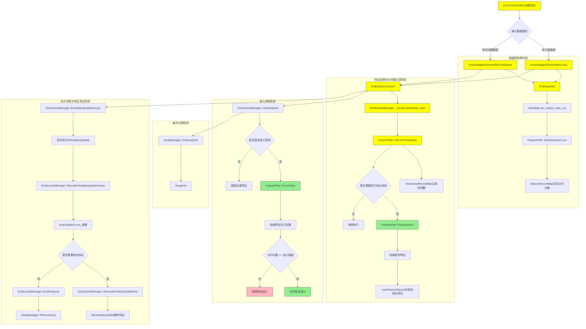
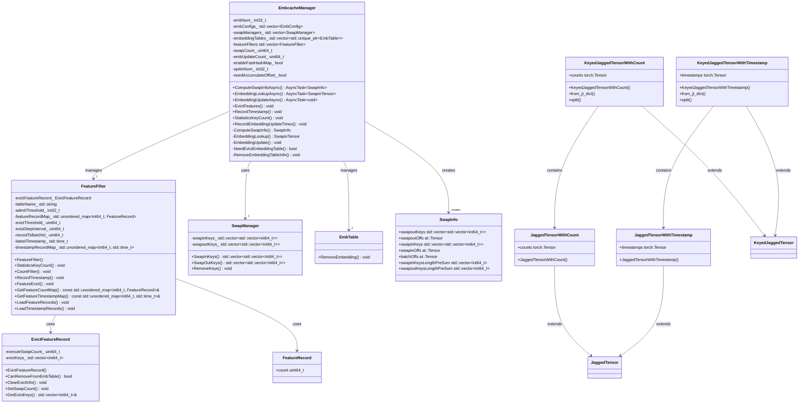
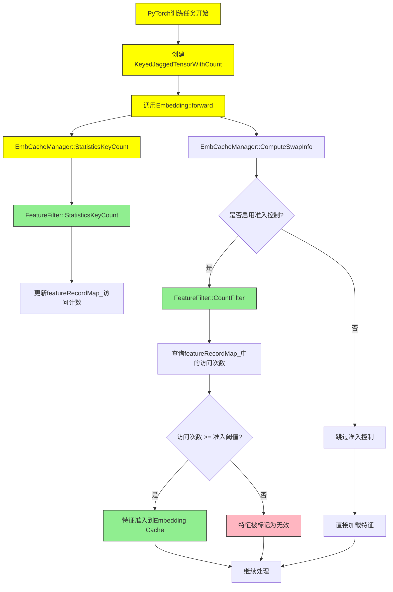
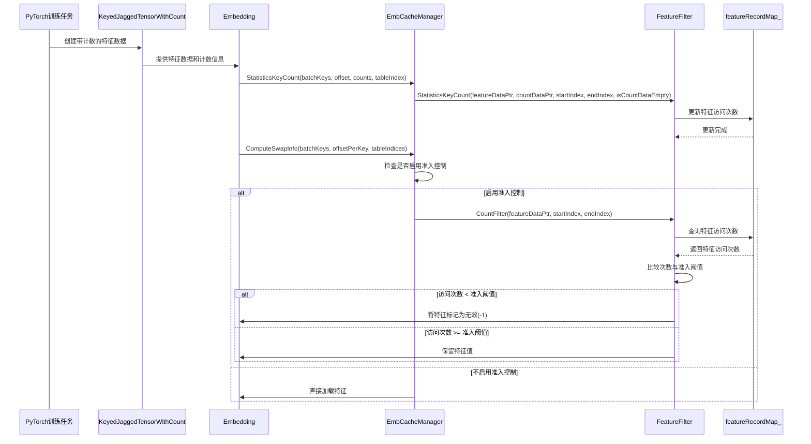
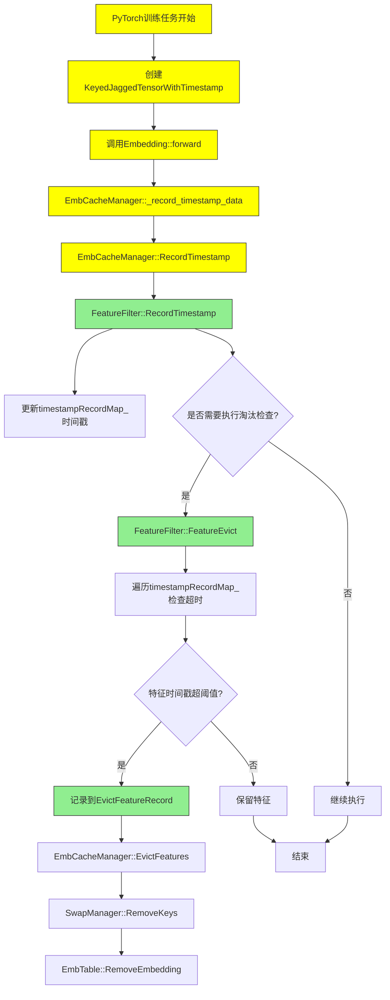
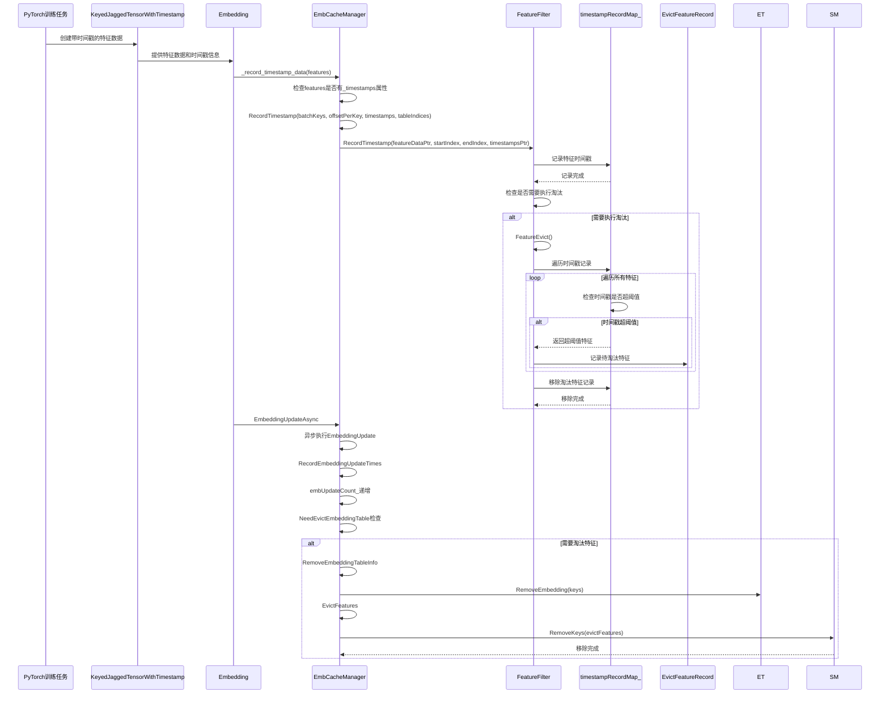
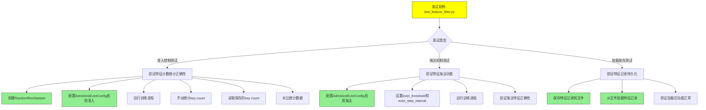

# Feature Filter功能设计文档

## 1. 概述

该设计文档详细描述了在Embedding Cache中新增Feature Filter功能的完整实现方案。Feature Filter功能主要用于控制特征的准入和淘汰策略，通过设置准入阈值和淘汰阈值来优化Embedding Cache的使用效率。该功能包含两个核心组件：FeatureFilter（特征过滤器）和EvictFeatureRecord（特征淘汰记录），它们协同工作以实现特征的准入控制和淘汰机制。

## 2. 功能需求

1. 支持基于访问频率的特征准入控制
2. 支持基于时间戳的特征淘汰机制
3. 提供可配置的准入阈值和淘汰阈值
4. 支持特征淘汰记录和管理
5. 支持特征记录的加载和持久化
6. 支持特征访问计数统计
7. 支持特征时间戳记录和处理

## 3. 系统架构

### 3.1 详细架构图



### 3.2 架构说明

#### 3.2.1 数据输入层
- 支持两种输入数据类型：`KeyedJaggedTensorWithCount` 和 `KeyedJaggedTensorWithTimestamp`
- 数据经过 `PostInputDist` 预处理

#### 3.2.2 特征统计与记录
- 通过 `FeatureFilter::StatisticsKeyCount` 统计特征访问次数并记录到 `featureRecordMap`
- 通过 `FeatureFilter::RecordTimestamp` 记录时间戳到 `timestampRecordMap`

#### 3.2.3 准入控制机制
- 可配置的准入控制开关
- 基于访问次数的准入策略，通过 `FeatureFilter::CountFilter` 实现
- 未达到阈值的特征将被拒绝准入

#### 3.2.4 特征淘汰机制
- 定期检查是否需要执行特征淘汰
- 通过 `FeatureFilter::FeatureEvict` 检查超时特征
- 记录待淘汰特征到 `evictFeatureRecord`

#### 3.2.5 缓存管理
- 通过 `SwapManager` 管理缓存交换信息
- 异步更新机制保证系统性能

#### 3.2.6 异步更新与清理
- 异步执行 `EmbeddingUpdate`
- 定期清理和淘汰不需要的特征
- 从 `EmbeddingTable` 和 `SwapManager` 中移除淘汰的特征

## 4. 设计方案

### 4.1 核心组件

#### 4.1.1 EvictFeatureRecord（特征淘汰记录）

EvictFeatureRecord类用于记录和管理待淘汰的特征信息：

```cpp
class EvictFeatureRecord {
public:
    EvictFeatureRecord() = default;
    bool CanRemoveFromEmbTable(uint64_t embUpdateCount) const;
    void ClearEvictInfo();
    void SetSwapCount(uint64_t swapCount);
    std::vector<int64_t>& GetEvictKeys();

private:
    uint64_t executeSwapCount = 0;
    std::vector<int64_t> evictKeys;
};
```

主要功能：
- CanRemoveFromEmbTable: 判断是否可以从Embedding表中移除特征
- ClearEvictInfo: 清除淘汰信息
- SetSwapCount: 设置交换计数
- GetEvictKeys: 获取待淘汰的键列表

#### 4.1.2 FeatureFilter（特征过滤器）

FeatureFilter类实现了具体的特征准入和淘汰逻辑：

```cpp
class FeatureFilter {
public:
    FeatureFilter(const std::string& tableName, int32_t admitThreshold, uint64_t evictThreshold,
                  uint64_t evictStepInterval);

    void StatisticsKeyCount(const int64_t* featureDataPtr, const int64_t* countDataPtr, int64_t startIndex,
                            int64_t endIndex, bool isCountDataEmpty);

    void CountFilter(int64_t* featureDataPtr, int64_t startIndex, int64_t endIndex);

    void RecordTimestamp(const int64_t* featureDataPtr, int64_t startIndex, int64_t endIndex,
                         const int64_t* timestampDataPtr);

    void FeatureEvict();

    const std::unordered_map<int64_t, FeatureRecord>& GetFeatureCountMap();
    const std::unordered_map<int64_t, std::time_t>& GetFeatureTimestampMap();

    void LoadFeatureRecords(const std::vector<int64_t>& keys, std::vector<uint64_t>& counts);
    void LoadTimestampRecords(const std::vector<int64_t>& keys, std::vector<int64_t>& timestamps);

private:
    std::string tableName;
    int32_t admitThreshold_ = -1;
    std::unordered_map<int64_t, FeatureRecord> featureRecordMap;
    uint64_t evictThreshold = 0;
    uint64_t evictStepInterval = 0;
    uint64_t recordTsBatchId = 0;
    std::time_t latestTimestamp = 0;
    std::unordered_map<int64_t, std::time_t> timestampRecordMap;
};
```

主要功能：
- StatisticsKeyCount: 统计特征访问次数
- CountFilter: 根据访问次数过滤特征
- RecordTimestamp: 记录特征时间戳
- FeatureEvict: 执行特征淘汰
- LoadFeatureRecords: 加载特征记录
- LoadTimestampRecords: 加载时间戳记录

### 4.2 类图



### 4.3 特征准入控制

#### 4.3.1 特征准入流程



#### 4.3.2 特征准入时序图



### 4.4 特征淘汰机制

#### 4.4.1 特征淘汰详细流程



#### 4.4.2 特征淘汰时序图



## 5. 接口设计

### 5.1 C++接口

#### FeatureFilter类接口

```cpp
class FeatureFilter {
public:
    FeatureFilter(const std::string& tableName, int32_t admitThreshold, uint64_t evictThreshold,
                  uint64_t evictStepInterval);
    
    void StatisticsKeyCount(const int64_t* featureDataPtr, const int64_t* countDataPtr, int64_t startIndex,
                            int64_t endIndex, bool isCountDataEmpty);

    void CountFilter(int64_t* featureDataPtr, int64_t startIndex, int64_t endIndex);

    void RecordTimestamp(const int64_t* featureDataPtr, int64_t startIndex, int64_t endIndex,
                         const int64_t* timestampDataPtr);

    void FeatureEvict();

    const std::unordered_map<int64_t, FeatureRecord>& GetFeatureCountMap();
    const std::unordered_map<int64_t, std::time_t>& GetFeatureTimestampMap();

    void LoadFeatureRecords(const std::vector<int64_t>& keys, std::vector<uint64_t>& counts);
    void LoadTimestampRecords(const std::vector<int64_t>& keys, std::vector<int64_t>& timestamps);
};
```

#### EvictFeatureRecord类接口

```cpp
class EvictFeatureRecord {
public:
    EvictFeatureRecord() = default;
    bool CanRemoveFromEmbTable(uint64_t embUpdateCount) const;
    void ClearEvictInfo();
    void SetSwapCount(uint64_t swapCount);
    std::vector<int64_t>& GetEvictKeys();
};
```

### 5.2 Python接口

在Python层，通过扩展KeyedJaggedTensor，添加了对特征计数和时间戳的支持，以支持基于访问频率的特征过滤和基于时间的特征淘汰功能：

```python
class KeyedJaggedTensorWithCount(KeyedJaggedTensor):
    def __init__(
        self,
        keys: List[str],
        values: torch.Tensor,
        counts: Optional[torch.Tensor] = None,
        weights: Optional[torch.Tensor] = None,
        lengths: Optional[torch.Tensor] = None,
        offsets: Optional[torch.Tensor] = None,
        stride: Optional[int] = None,
        stride_per_key_per_rank: Optional[List[List[int]]] = None,
        length_per_key: Optional[List[int]] = None,
        lengths_offset_per_key: Optional[List[int]] = None,
        offset_per_key: Optional[List[int]] = None,
        index_per_key: Optional[List[int]] = None,
    ) -> None:
```

该类扩展了标准的KeyedJaggedTensor，增加了[counts]属性，用于记录每个特征ID的出现次数。这些计数信息会被传递给FeatureFilter的StatisticsKeyCount方法，用于统计特征访问频率，进而实现基于访问频率的准入控制。

```python
class KeyedJaggedTensorWithTimestamp(KeyedJaggedTensor):
    def __init__(
        self,
        keys: List[str],
        values: torch.Tensor,
        timestamps: Optional[torch.Tensor] = None,
        weights: Optional[torch.Tensor] = None,
        lengths: Optional[torch.Tensor] = None,
        offsets: Optional[torch.Tensor] = None,
        stride: Optional[int] = None,
        stride_per_key_per_rank: Optional[List[List[int]]] = None,
        length_per_key: Optional[List[int]] = None,
        lengths_offset_per_key: Optional[List[int]] = None,
        offset_per_key: Optional[List[int]] = None,
        index_per_key: Optional[List[int]] = None,
    ) -> None:
```

该类扩展了标准的KeyedJaggedTensor，增加了[timestamps]属性，用于记录每个特征ID的时间戳。这些时间戳信息会被传递给FeatureFilter的RecordTimestamp方法，用于实现基于时间的特征淘汰机制。

这些扩展类使得Embedding Cache能够同时支持基于访问频率的准入控制和基于时间戳的特征淘汰功能。

## 6. 用例设计

### 6.1 特征准入控制用例

#### 用例名称
特征准入控制

#### 用例描述
系统根据特征的历史访问次数决定是否将特征加载到Embedding Cache中

#### 前置条件
1. FeatureFilter已初始化并配置了准入阈值
2. 存在待加载的特征数据

#### 主要流程
1. 系统接收特征加载请求
2. FeatureFilter统计特征访问次数
3. FeatureFilter检查特征是否满足准入条件
4. 如果满足准入条件，特征被加载到Embedding Cache
5. 如果不满足准入条件，特征被标记为无效

#### 后置条件
特征根据准入策略被正确处理

### 6.2 特征淘汰用例

#### 用例名称
特征淘汰

#### 用例描述
系统根据特征的时间戳信息淘汰长时间未使用的特征

#### 前置条件
1. FeatureFilter已初始化并配置了淘汰阈值
2. 系统中存在已加载的特征

#### 主要流程
1. 系统定期检查特征使用情况
2. FeatureFilter记录特征时间戳
3. FeatureFilter识别需要淘汰的特征
4. 将待淘汰特征记录到EvictFeatureRecord
5. 在适当时机从Embedding Cache中移除特征

#### 后置条件
长时间未使用的特征被正确淘汰，释放内存空间

### 6.3 特征记录加载用例

#### 用例名称
特征记录加载

#### 用例描述
系统支持从持久化存储中加载特征访问记录和时间戳记录

#### 前置条件
1. FeatureFilter已初始化
2. 存在持久化的特征记录数据

#### 主要流程
1. 系统启动或恢复时加载特征记录
2. FeatureFilter加载特征访问次数记录
3. FeatureFilter加载特征时间戳记录
4. 系统基于加载的记录继续特征过滤操作

#### 后置条件
特征记录被成功加载并可用于后续的过滤操作

### 6.4 特征计数统计用例

#### 用例名称
特征计数统计

#### 用例描述
系统统计特征的访问次数，用于准入控制决策

#### 前置条件
1. FeatureFilter已初始化并配置了准入阈值
2. 存在携带计数信息的KeyedJaggedTensorWithCount数据

#### 主要流程
1. 系统接收携带特征计数信息的KeyedJaggedTensorWithCount数据
2. FeatureFilter通过StatisticsKeyCount方法统计特征访问次数
3. 访问次数信息被存储在featureRecordMap中
4. 后续的准入控制将基于这些统计信息进行决策

#### 后置条件
特征访问次数被正确统计并存储，可用于后续的准入控制

### 6.5 时间戳处理用例

#### 用例名称
时间戳处理

#### 用例描述
系统记录特征的时间戳信息，用于淘汰长时间未使用的特征

#### 前置条件
1. FeatureFilter已初始化并配置了淘汰阈值
2. 存在携带时间戳信息的KeyedJaggedTensorWithTimestamp数据

#### 主要流程
1. 系统接收携带时间戳信息的KeyedJaggedTensorWithTimestamp数据
2. FeatureFilter通过RecordTimestamp方法记录特征时间戳
3. 时间戳信息被存储在timestampRecordMap中
4. 在适当的时机，系统根据时间戳判断是否需要淘汰特征

#### 后置条件
特征时间戳被正确记录并存储，可用于后续的淘汰策略

## 7. 测试用例图



## 8. 性能优化

1. 使用std::unordered_map存储特征信息，提高查询效率
2. 通过批量处理特征统计和过滤操作，减少系统调用次数
3. 异步淘汰机制，避免阻塞主流程
4. 只在必要时执行淘汰检查，减少计算开销

## 9. 安全性考虑

1. 对特征记录数据进行定期清理，防止内存泄漏
2. 添加边界检查，防止数组越界访问
3. 使用安全的字符串处理函数
4. 对输入参数进行有效性验证

## 10. 测试方案

1. 单元测试：对FeatureFilter和EvictFeatureRecord类进行独立测试
2. 集成测试：测试特征准入和淘汰功能在完整流程中的表现
3. 压力测试：测试在高并发场景下的性能表现
4. 边界测试：测试各种边界条件下的正确性

## 11. 部署方案

1. 通过配置文件设置准入阈值和淘汰阈值
2. 提供监控指标，用于观察特征过滤效果
3. 支持动态调整阈值参数，无需重启服务

这个设计方案实现了基于访问频率和时间戳的特征准入和淘汰机制，能够有效提高Embedding Cache的利用率和推荐系统的整体性能.