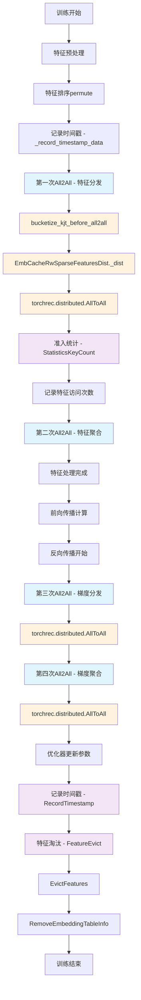

  # RecSDK中四次All2All操作与准入淘汰机制详细流程设计

## 概述

在RecSDK中，四次All2All操作贯穿整个分布式训练流程，与准入淘汰机制紧密交互。本文档详细描述了这些操作的函数调用链和交互过程。

## 流程图

## 详细函数调用链

### 第一次All2All之前的操作（前向传播开始）

1. **入口函数**：[EmbCacheTrainPipelineSparseDist.progress](file://c:\zengxiong\RecSDK\torchrec\torchrec_embcache\src\torchrec_embcache\distributed\train_pipeline.py#L653-L733)
   - 触发整个训练流程

2. **特征预处理**：[EmbCacheShardedEmbeddingCollection.input_dist](file://c:\zengxiong\RecSDK\torchrec\torchrec_embcache\src\torchrec_embcache\distributed\embedding.py#L691-L731)
   - 处理VBE（Variable Batch Size Embedding）特征
   - 对特征进行填充处理：[pad_vbe_kjt_lengths](file://c:\zengxiong\RecSDK\torchrec\torchrec_embcache\src\torchrec_embcache\distributed\embedding.py#L722-L722)

3. **特征排序**：[features.permute](file://c:\zengxiong\RecSDK\torchrec\torchrec_embcache\src\torchrec_embcache\distributed\embedding.py#L725-L728)
   - 根据[_features_order](file://c:\zengxiong\RecSDK\torchrec\torchrec_embcache\src\torchrec_embcache\distributed\embedding.py#L179-L179)和[_features_order_tensor](file://c:\zengxiong\RecSDK\torchrec\torchrec_embcache\src\torchrec_embcache\distributed\embedding.py#L180-L180)对特征进行排序

4. **记录时间戳数据**：[self._record_timestamp_data(features)](file://c:\zengxiong\RecSDK\torchrec\torchrec_embcache\src\torchrec_embcache\distributed\embedding.py#L747-L756)
   - 位置：[torchrec_embcache/distributed/embedding.py](file://c:\zengxiong\RecSDK\torchrec\torchrec_embcache\src\torchrec_embcache\distributed\embedding.py)
   - 功能：记录淘汰要用的timestamp数据
   - 条件：当启用特征淘汰且特征包含时间戳信息时执行

### 第一次All2All - 特征分发（前向传播开始）

5. **特征分发初始化**：[EmbCacheRwSparseFeaturesDist.__init__](file://c:\zengxiong\RecSDK\torchrec\torchrec_embcache\src\torchrec_embcache\distributed\sharding\rw_sharding.py#L135-L189)
   - 初始化分布式特征处理模块

6. **特征分桶处理**：[bucketize_kjt_before_all2all](file://c:\zengxiong\RecSDK\torchrec\hybrid_torchrec\hybrid_torchrec\distributed\sharding\hybrid_rw_sharding.py#L59-L60)
   - 位置：[hybrid_torchrec/distributed/sharding/hybrid_rw_sharding.py](file://c:\zengxiong\RecSDK\torchrec\hybrid_torchrec\hybrid_torchrec\distributed\sharding\hybrid_rw_sharding.py)
   - 功能：将特征按照目标rank进行分桶处理

7. **执行分发**：[EmbCacheRwSparseFeaturesDist._dist](file://c:\zengxiong\RecSDK\torchrec\torchrec_embcache\src\torchrec_embcache\distributed\sharding\rw_sharding.py#L164-L164)
   - 位置：[torchrec_embcache/distributed/sharding/rw_sharding.py](file://c:\zengxiong\RecSDK\torchrec\torchrec_embcache\src\torchrec_embcache\distributed\sharding\rw_sharding.py)
   - 功能：执行第一次All2All操作，分发特征到各设备

8. **底层All2All操作**：torchrec.distributed.AllToAll
   - PyTorch分布式通信操作

### 准入统计子流程

9. **统计特征访问次数**：[StatisticsKeyCount](file://c:\zengxiong\RecSDK\torchrec\torchrec_embcache\src\torchrec_embcache\csrc\feature_filter\feature_filter.h#L31-L31)
   - 位置：[torchrec_embcache/csrc/feature_filter/feature_filter.h](file://c:\zengxiong\RecSDK\torchrec\torchrec_embcache\src\torchrec_embcache\csrc\feature_filter\feature_filter.h)
   - 功能：统计特征访问频率，用于准入判断

### 第二次All2All - 特征聚合（前向传播中）

10. **特征聚合**：[SparseFeaturesPostDist.__init__](file://c:\zengxiong\RecSDK\torchrec\hybrid_torchrec\hybrid_torchrec\distributed\sharding\post_input_dist.py#L36-L100)
    - 位置：[hybrid_torchrec/distributed/sharding/post_input_dist.py](file://c:\zengxiong\RecSDK\torchrec\hybrid_torchrec\hybrid_torchrec\distributed\sharding\post_input_dist.py)
    - 功能：聚合各设备处理后的特征

11. **执行聚合**：[SparseFeaturesPostDist._dist](file://c:\zengxiong\RecSDK\torchrec\hybrid_torchrec\hybrid_torchrec\distributed\sharding\post_input_dist.py#L74-L74)
    - 功能：执行第二次All2All操作，聚合特征

### 前向和反向传播

12. **前向传播**：模型前向计算过程
13. **反向传播开始**：[torch.sum(losses, dim=0).backward()](file://c:\zengxiong\RecSDK\torchrec\torchrec_embcache\src\torchrec_embcache\distributed\train_pipeline.py#L718-L718)
     - 位置：[torchrec_embcache/distributed/train_pipeline.py](file://c:\zengxiong\RecSDK\torchrec\torchrec_embcache\src\torchrec_embcache\distributed\train_pipeline.py)

### 第三次All2All - 梯度分发（反向传播开始）

14. **梯度分发**：PyTorch自动梯度计算
     - 在反向传播过程中，梯度需要按照原始特征分布分发回各设备

### 第四次All2All - 梯度聚合（反向传播结束）

15. **梯度聚合**：[self._optimizer.step()](file://c:\zengxiong\RecSDK\torchrec\torchrec_embcache\src\torchrec_embcache\distributed\train_pipeline.py#L721-L721)
     - 位置：[torchrec_embcache/distributed/train_pipeline.py](file://c:\zengxiong\RecSDK\torchrec\torchrec_embcache\src\torchrec_embcache\distributed\train_pipeline.py)
     - 功能：聚合各设备梯度，更新嵌入表参数

### 准入淘汰子流程

16. **记录时间戳**：[RecordTimestamp](file://c:\zengxiong\RecSDK\torchrec\torchrec_embcache\src\torchrec_embcache\csrc\feature_filter\feature_filter.h#L33-L33)
     - 位置：[torchrec_embcache/csrc/feature_filter/feature_filter.h](file://c:\zengxiong\RecSDK\torchrec\torchrec_embcache\src\torchrec_embcache\csrc\feature_filter\feature_filter.h)
     - 功能：记录特征时间戳信息

17. **特征淘汰**：[FeatureEvict](file://c:\zengxiong\RecSDK\torchrec\torchrec_embcache\src\torchrec_embcache\csrc\feature_filter\feature_filter.h#L34-L34)
     - 位置：[torchrec_embcache/csrc/feature_filter/feature_filter.h](file://c:\zengxiong\RecSDK\torchrec\torchrec_embcache\src\torchrec_embcache\csrc\feature_filter\feature_filter.h)
     - 功能：识别需要淘汰的特征

18. **执行淘汰**：[EvictFeatures](file://c:\zengxiong\RecSDK\torchrec\torchrec_embcache\src\torchrec_embcache\csrc\embedding_cache\embcache_manager.h#L134-L134)
     - 位置：[torchrec_embcache/csrc/embedding_cache/embcache_manager.h](file://c:\zengxiong\RecSDK\torchrec\torchrec_embcache\src\torchrec_embcache\csrc\embedding_cache\embcache_manager.h)
     - 功能：实际执行特征淘汰操作

19. **移除表信息**：[RemoveEmbeddingTableInfo](file://c:\zengxiong\RecSDK\torchrec\torchrec_embcache\src\torchrec_embcache\csrc\embedding_cache\embcache_manager.h#L163-L163)
     - 位置：[torchrec_embcache/csrc/embedding_cache/embcache_manager.h](file://c:\zengxiong\RecSDK\torchrec\torchrec_embcache\src\torchrec_embcache\csrc\embedding_cache\embcache_manager.h)
     - 功能：从嵌入表中移除被淘汰的特征信息

## 关键交互点说明

### All2All与准入淘汰机制的交互

1. **第一次All2All前**：进行特征预处理、排序和时间戳记录
2. **第一次All2All后**：立即调用[StatisticsKeyCount](file://c:\zengxiong\RecSDK\torchrec\torchrec_embcache\src\torchrec_embcache\csrc\feature_filter\feature_filter.h#L31-L31)统计特征访问次数
3. **第四次All2All后**：调用[RecordTimestamp](file://c:\zengxiong\RecSDK\torchrec\torchrec_embcache\src\torchrec_embcache\csrc\feature_filter\feature_filter.h#L33-L33)记录时间戳，然后执行[FeatureEvict](file://c:\zengxiong\RecSDK\torchrec\torchrec_embcache\src\torchrec_embcache\csrc\feature_filter\feature_filter.h#L34-L34)进行特征淘汰

### 流水线中的并行处理

在[HybridTrainPipelineSparseDist](file://c:\zengxiong\RecSDK\torchrec\hybrid_torchrec\hybrid_torchrec\distributed\hybrid_train_pipeline.py#L211-L211)中，通过[TaskType](file://c:\zengxiong\RecSDK\torchrec\hybrid_torchrec\hybrid_torchrec\distributed\hybrid_train_pipeline.py#L59-L59)枚举定义了多个处理阶段：

1. [TaskType.SPLIT](file://c:\zengxiong\RecSDK\torchrec\hybrid_torchrec\hybrid_torchrec\distributed\hybrid_train_pipeline.py#L60-L60) - 特征分割
2. [TaskType.FIRST_ALL2ALL](file://c:\zengxiong\RecSDK\torchrec\hybrid_torchrec\hybrid_torchrec\distributed\hybrid_train_pipeline.py#L61-L61) - 第一次All2All
3. [TaskType.SENCOND_ALL2ALL](file://c:\zengxiong\RecSDK\torchrec\hybrid_torchrec\hybrid_torchrec\distributed\hybrid_train_pipeline.py#L62-L62) - 第二次All2All
4. [TaskType.POST_INPUT](file://c:\zengxiong\RecSDK\torchrec\hybrid_torchrec\hybrid_torchrec\distributed\hybrid_train_pipeline.py#L63-L63) - 后处理
5. [TaskType.COPY2NPU](file://c:\zengxiong\RecSDK\torchrec\hybrid_torchrec\hybrid_torchrec\distributed\hybrid_train_pipeline.py#L64-L64) - 拷贝到NPU

## 总结

四次All2All操作在分布式训练中起到了关键作用，它们不仅负责特征和梯度在设备间的分发与聚合，还与准入淘汰机制紧密交互。通过在关键节点插入统计和淘汰操作，系统能够在保证训练效率的同时，有效管理有限的嵌入缓存资源。在第一次All2All之前，系统会进行特征预处理、排序和时间戳记录等操作，为后续的准入淘汰机制提供必要的信息。