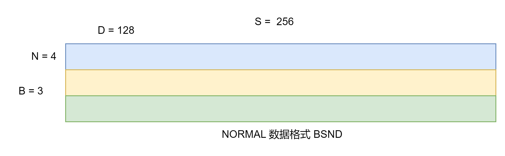
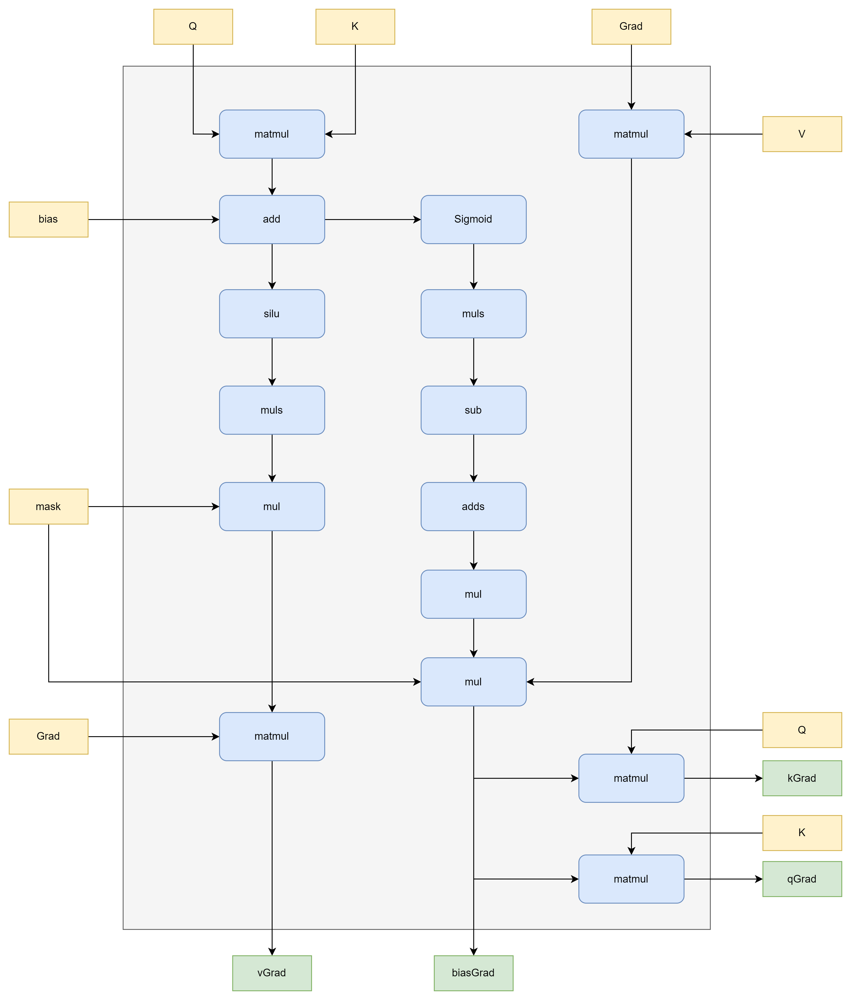

# HstuDenseBackward

## 支持产品型号
Atlas A2 训练系列产品 
产品形态详细说明请参见[昇腾产品形态说明](https://www.hiascend.com/document/detail/zh/CANNCommunityEdition/800alpha002/quickstart/quickstart/quickstart_18_0002.html)

## 功能描述
* 算子功能：推荐场景下，使用Hstu融合算子实现推荐场景中的注意力机制
* 计算公式：
    $$
    qkb=matmul(Q,K_{}^{T})+bias
    $$
    $$
    score=Mask(Silu(qkb))/S
    $$
    $$
    vGrad=matmul(score_{}^{T},G)
    $$
    $$
    biasGrad=Mask(matmul(G,V_{}^{T})*Sigmoid(qkb)(1+qkb(1-Sigmoid(qkb))))/S
    $$
    $$
    qGrad=matmul(biasGrad,k)
    $$
    $$
    kGrad=matmul(biasGrad_{}^{T},q)
    $$

其中Q,K,V可以是normal格式，也可以是jagged格式
* normal格式：B,S,N,D 4维数据格式
* jagged格式：s_b,N,D 3维数据格式 (稠密格式 为了节省显存)

normal格式如下图所示：

jagged格式如下图所示：


## 实现原理

* 输入Q，K，V，Grad是normal格式或者jagged格式, 首先分别进行matmul计算
* mask和bias按照参数决定是否加入计算
* score和biasGrad的计算中，会除以序列长度S，normal模式S固定，jagged模式根据不同batch切换
* 最后score，biasGrad分别和Q/K/V做矩阵乘法得到输出梯度
## 算子输入与输出
| 名称 | 类型 | 数据类型 | 数据格式 | 备注 |
|----|----|----|----|----|
| grad | 输入| float32/float16/bfloat16 | normal/jagged |
| q | 输入| float32/float16/bfloat16 | normal/jagged |
| k | 输入| float32/float16/bfloat16 | normal/jagged |
| v | 输入| float32/float16/bfloat16 | normal/jagged |
| mask | 可选输入 | float32/float16/bfloat16 | B,N,S,S | S为模型最大的序列长度max_seq_len |
| bias | 可选输入 | float32/float16/bfloat16 | B,N,S,S | S为模型最大的序列长度max_seq_len |
| layout | 属性 | string | N/A | "normal"代表Q,K,V数据格式为B,S,N,D格式，“jagged”代表Q,K,V数据格式为s_b,N,D格式 |
| mask_type | 属性 | int | N/A | 0:使用内置下三角掩码 1:使用内置上三角掩码(未支持) 2:不使用mask(即使mask传值) 3:使用自定义mask(需要输入mask) |
| max_seq_len | 属性 | int | N/A | 表示模型最大序列长度 |
| siluScale | 属性 | float | N/A | 支持用户传入自定义siluScale, 不传入时默认值为1/max_seq_len|
| seq_offsets | 可选属性 | list[int64] | N/A | 表示每个序列的偏移，其中第一个序列的偏移一定是0，此选项只对jagged格式下生效，normal格式不生效。|
| q_grad | 输出 | float32/float16/bfloat16 | normal/jagged| 如果Q是normal格式，则输出也为normal格式，如果Q是jagged格式，则输出为jagged格式 |
| k_grad | 输出 | float32/float16/bfloat16 | normal/jagged| 如果K是normal格式，则输出也为normal格式，如果Q是jagged格式，则输出为jagged格式 |
| v_grad | 输出 | float32/float16/bfloat16 | normal/jagged| 如果V是normal格式，则输出也为normal格式，如果Q是jagged格式，则输出为jagged格式 |
| bias_grad | 输出 | float32/float16/bfloat16 | B,N,S,S | 如果Q,K,V是normal格式，则S为等长的序列长度，如果Q,K,V是jagged格式，则S为变长序列中最大的序列长度 |


## 算子约束
* B: batch_size 表征批处理的大小，当前取值范围[1, 2048]。
* S: seq_lens 表征序列长度，当前取值范围[1, 20480]。
* N：head_num 表征头个数，当前取值为[2,4,6,8]。
* D: head_dim 表征维度，当前取值范围范围[16, 512]，并且需要满足是16的倍数。
* 以上四个维度数值均不能为0，为0时算子输入为空数据，不会执行算子计算;并且其中B、N、S参数影响bias、mask占用显存大小，请根据实际内存合理设置参数大小。
* 当为jagged模式时，bias的shape为B,N,S,S S为所有序列中最大的序列长度，比如此时有两个序列，一个序列长度为256，另一个序列长度为512，则S为512。
* 当为jagged模式时，需要传递可选属性seq_offsets，比如当前有两个序列，一个序列长度为256,另一个序列长度为512，则seqp_offsets = [0, 256, 768]，伪代码如下:
```python
max_seq_len = 512
batch_size = 2
seq_lens = np.random.randint(1, max_seq_len + 1, (batch_size)).astype(np.int64)

seq_offset = torch.concat((torch.zeros((1, ), dtype=torch.int64), \
        torch.cumsum(torch.from_numpy(seq_lens), axis=0))).to(torch.int64).numpy()
```


## 使用方式

### 下载软件包并解压
tar -zxvf Ascend-mindxsdk-mxrec-add-ons-linux-aarch64.tar.gz

### 部署安装算子
进入解压后的mxrec_ops目录
执行./mxrec_opps_hstu_dense_backward.run 完成算子安装部署

### 编译torch适配层SO
进入解压后的torch_library/hstu目录
执行 build build_ops.sh命令完成torch适配层编译

### 执行样例
进入解压后的example/torch_demo/hstu_dense目录
执行pytest hstu_dense_backward_demo.py 
该样例只能作为精度测试不能作为性能测试的基准