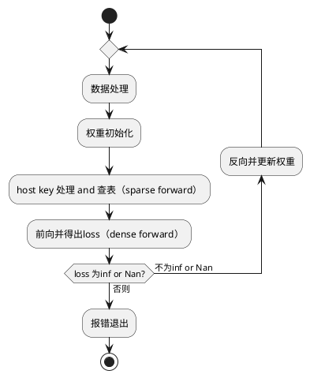

# 背景
深度学习推荐系统 最终呈现在互联网中的业务效果：
客户通过精排之后的展示页面，是否被所推荐的商家或者物品吸引，从而去点击去查看详情，或者产生加购物、收藏、购买等操作

要衡量推荐模型的效果，需要通过用户各种动作的宏观统计数据，生成AUC（Area Under the Curve）指标, 例如click auc（是否点击的预测效果）、pay auc（是否购买的预测效果）来评估

例如 开源模型 dlrm 的精度指标 auc 0.8025，就是典型的click auc

推荐模型的auc哪怕降低万分之五，都有可能在业务层面带来大量的 成单失败、用户流失，这在面对头部互联网客户日均亿级以上的流水时，将产生十分巨大的损失。

可以说，精度是否稳定达标（至少打平GPU、CPU） 是互联网推荐业务的***准入指标***。决定了 当前软硬解决方案 ***是否能用***。

精度对不齐就是***不可用***，精度不合预期掉点一定是 ***致命问题***，将产生巨大的经济损失。

# 推荐模型关键训练流程

# 随机性消除 与 标杆比对

关键流程中的大多环节都涉及到一定的随机性

随机性的存在对深度学习至关重要：具有提高模型泛化性、降低过拟合，增强鲁棒性，甚至提高模型表现等能力：***所有上线的业务训练模型都是集成了很多随机性策略的***

但是精度看护 若是在各个环节存在随机性，就从：***确定性问题*** 只需要观察是与不是  变成了  ***统计学上是否可靠***的问题

***统计学上是否可靠*** 不仅很难标准化，而且处处充满了争论。可信度大大降低

所以精度看护的前提，就是 ***随机性消除***， 把统计学问题，变成单一的 ***功能与实现是否正确*** 这一个确定性问题。

## 数据处理
随机性消除：
1.数据集是生成的情况

2.数据集是确定的落盘文件的情况
会产生随机性的当前来看只有shuffle，可以通过固定随机种子来确定
或者直接把shuffle取消

标杆比对:
比对方法直接通过tf导出数据集输出并落盘
比对两次落盘文件的二进制层面是否相同即可

todo 01:
同样的随机种子，不同的容器 或者机器 是否读取数据集产生的数据流顺序、内容都是一样的？

## 权重初始化
权重的初始化同样可以通过随机种子来实现

todo 01:
但是同样的随机种子，不同的容器 或者机器 是否读取数据集产生的数据流顺序、内容都是一样的？

随机性消除：
加载同一份初始化好的模型就好了

标杆比对:
处于训练的第0步，加载之后，直接保存
比对保存模型参数的二进制即可

## host key 处理 与 查表
不考虑模型并行的话，MxRec 的做了两个关键的事情：
1.使用key process通过gather实现了一种更加NPU亲和的查表（本身是MutableDenseHashTable LookUp等效实现，但是把很多工作放在了CPU）
2.构建了一个 CPU的异步流水

所以不论是什么注入启动方式：Feature Spec也好， 改图也好
还是是否可以让Embedding在HBM动态扩展（动态扩容）
或者是 DDR SSD等进一步的内存扩展方案也好
都要保证 Lookup的等效性、正确性

所以我们在通过数据集保证feature(ids)进入的内容顺序一致时，保证查出Embedding与正确实现一致
即可对MxRec查表部分的逻辑形成看护

随机性消除：
不涉及

todo 02：
需不需要开启确定性计算？

标杆比对:
通过dump下特定算子 并对其输入输出进行二进制比对即可

## dense 前向正确性看护
{dump_path}/{time}/{deviceid}/{model_name}/{model_id}/{data_index}
正向的流程是
sparse 查表 -> dense 计算 -> loss计算

MxRec对整个计算图（计算过程）的修改都集中在Embedding部分（正反向、Sparse并行的更新）
dense计算的正确性是由CANN来保证的
包括GE图处理、调度的正确性，融合规则、算子融合的正确性
这部分我们也可以当作一个黑盒

随机性消除：
1.算子本身引入的硬件带来的随机性
通过CANN提供的确定性计算功能来实现

2.CANN随机性的引入主要是版本：不同的release版修改、优化了图处理规则，算子，融合等 都有可能引入硬件层面的随机性
首先，这些随机性不代表 这些更改都是 错误的
判断是否错误的表准是模型评价指标是否有劣化
确认看护、比对的CANN版本完全一致 即可避免CANN迭代带来的随机性

标杆比对:
开启确定性计算后直接比对Loss 必须在数值层面完全匹配

## dense 反向正确性
反向，即通过Loss对模型Dense Sparse部分进行反向更新
sparse 反向更新embedding <- dense 反向计算 并更新权重  <- loss计算

随机性消除：
同 dense 前向一样，通过确定性计算来消除

标杆比对:
通过 dump sparse embedding的反向更新算子来进行二进制比对

# 具体实现
## 随机性消除
通过在examples模型仓 代码里添加配置来进行控制

## 模型导出
通过在examples模型仓 代码里添加配置来进行控制
将各个流程的数据都导出到对应的目录

## 精度比对
通过提供一个可以交互的实时工具来进行比对

