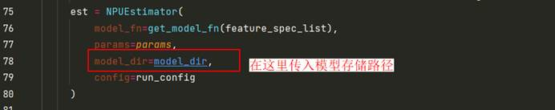
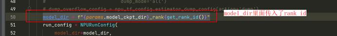
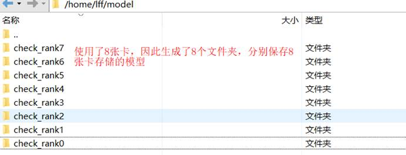
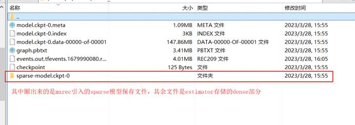
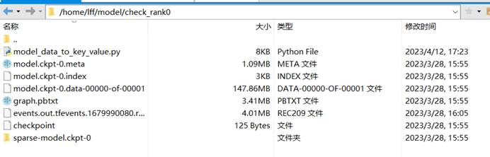
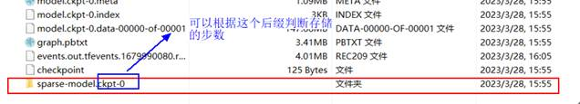
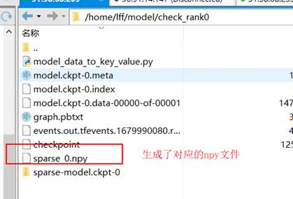
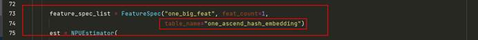
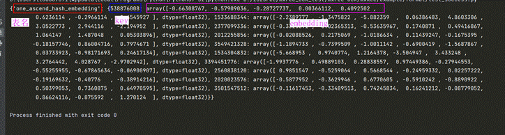

# 模型数据转换工具（key-value）使用说明

### 1. 美团1207模型ckpt保存路径说明

#### 1.1 训练时1207模型保存参数设置：（estimator模式）

#### 1.2 训练后模型保存路径目录展示如下：

#### 1.3 下面来看单个文件夹下存储的内容，以check_ran0为例：

我们的模型数据转换工具就是要对该**sparse****文件夹中的数据进行转换**,转换成key-value形式，保存格式是npy文件，详情参考3. 输出文件格式说明。

下面介绍**如何使用该模型数据转换工具**。

 

### 2. 使用工具demo说明：

**该转换工具model_data_to_key_value.py一共需要4个参数，path、name、ddr、step**

 

| **参数名** | **数据类型** | **必选** | **默认值** | **描述**                           |
| ---------- | ------------ | -------- | ---------- | ---------------------------------- |
| --path     | String       | 是       |            | 保存模型embedding数据的根路径      |
| --name     | String       | 否       |            | 输出文件的名称，最终输出<name>.npy |
| --ddr      | Bool         | 否       | False      | 保存数据是否开启ddr模式            |
| --step     | Int          | 否       | 0          | 保存数据所属训练步数               |

 

#### 2.1 参数确定：

下面是一个选择参数的示例。

##### **1)** path路径确定

我们选择1207保存下来的0卡模型文件夹下的sparse部分数据进行转换，因此路径选到目录下：/home/lff/model/check_rank0/

**--path = /home/lff/model/check_rank0** 

（多卡的目录需要转换多次，一次只能转换一张卡下面sparse的数据）

 

##### 2) name参数: 输出文件的名字，格式为.npy；

例如：sparse_0,经过转换后的sparse数据就保存在当前目录下的sparse_0.npy文件中；

**--name = sparse_0** 

##### 3) ddr参数：美团模型未开启ddr模式，因此选择False

**--ddr = False**

##### 4）step参数:在上面1207模型存储的目录下面，存了第0步的模型。

**--step=0**

 

#### **2.2** **执行工具命令**

python3 model_data_to_key_value.py --path=/home/lff/model/check_rank0 --name=sparse_0 --ddr=False --step=0

#### **2.3** **执行结果展示**

 

 

### 3. 输出文件格式说明

**.npy** 文件

【在使用mxrec的时候，传入了一个特征one_big_feat，存在表名为one ascend hash embedding 的表里面。】如下图所示：

 

转换了的npy文件构成为：

{**<embedding****表1>**：{key1:embedding1,key2:embedding2……}，

 <embedding表2>：{key1:embedding1,key2:embedding2……}

 ……

}

示例：转换后的npy文件裁剪了10个key

 