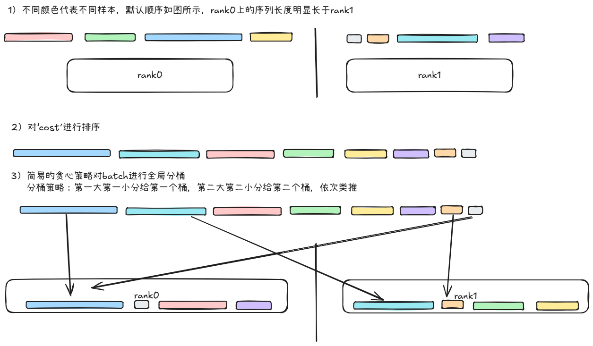

# recsys-gr多卡负载均衡
本文档主要介绍如何进行recsys-gr的负载均衡优化
开源项目地址：https://github.com/NVIDIA/recsys-examples

## 问题分析
多卡训练存在较大的快慢卡问题，影响模型端到端训练耗时，单卡耗时与单卡的token_nums直接相关，单卡的token_nums由多个长短不一的sample组成，但是这些sample在同一step中由不同卡进行训练对模型精度没有影响
## 实现原理
通过对dataloader取出的数据进行重排，保证每张卡上的token_nums大小接近

举例：rank_size=2 batch size=4 global_batch_size=8
假设全局分发的样本为sample_idx[0,1,2,3,4,5,6,7], 如果需要对每张卡上的token_nums进行均衡，需要知道每条sample对应的'代价'这里的代价是条sample的seqLen，
在kuairand数据集取对应的jsonlen获取对应样本的seqLen
如下函数

```
    def _fast_seq_len(self, x) -> int:
        # 根据json字符串估算长度
        s = x.strip()
        if len(s) <= 2:
            return 0
        return s.count(',') + 1
```



## 步骤
1.进入recsys-examples目录执行如下命令：
```commandline
# 使用负载均衡的方式构造batch
git apply dataset_balance.patch
```


